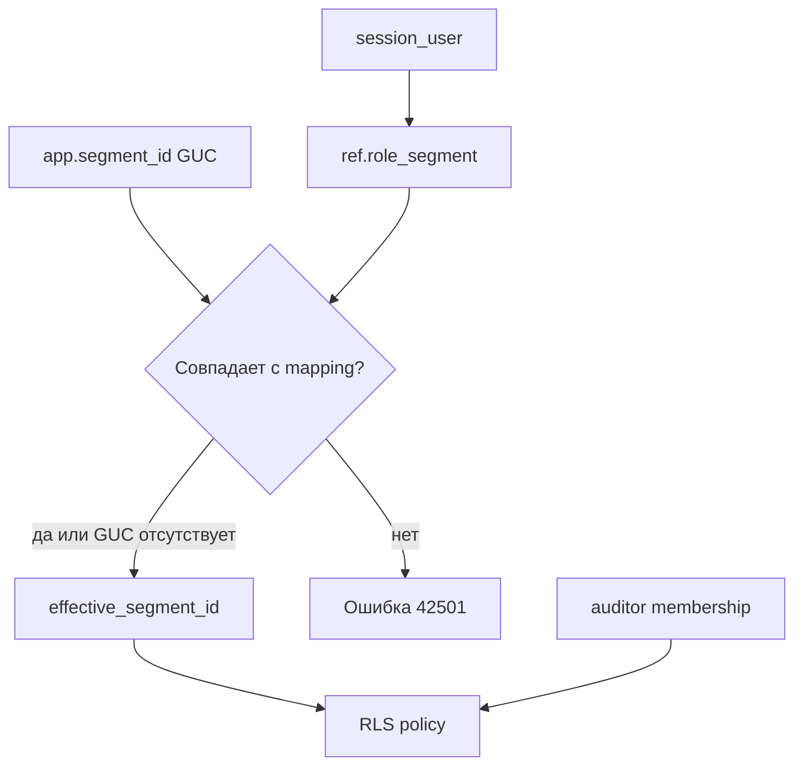

# Лабораторная работа № 3

## Построчная изоляция данных с Row-Level Security

[← Лабораторная работа № 2](02-lab-2-security-definer-and-tests.md) · [К содержанию](../README.md) · [Лабораторная работа № 4 →](04-lab-4-audit-performance-and-jit.md)

## 1. Цель и границы RLS

RBAC из предыдущих работ отвечает на вопрос: «может ли роль выполнять `SELECT`, `INSERT`, `UPDATE` или `DELETE` над таблицей?». RLS добавляет второй вопрос: «над какими строками разрешена операция?».

В учебной модели:

- `lab_alice` сопоставлена с Новосибирским филиалом (`segment_id = 1`);
- `lab_bob` сопоставлен с Московским филиалом (`segment_id = 2`);
- `lab_auditor` является членом роли `auditor` и видит все сегменты;
- `app_writer` не получает `BYPASSRLS`;
- владельцы функций не получают `BYPASSRLS`;
- на прикладных таблицах используется `FORCE ROW LEVEL SECURITY`.

RLS не применяется к `TRUNCATE`, проверкам внешних ключей и некоторым операциям целиком над таблицей. Она также не заменяет `GRANT`: запрос должен пройти и табличную проверку, и политику строк.

## 2. Как вычисляется контекст



Контекст GUC используется как удобная транзакционная передача значения, но не является источником полномочия. Источник полномочия — защищённая таблица `ref.role_segment`.

### 2.1. current_user и session_user

| Ситуация | `session_user` | `current_user` |
|---|---|---|
| обычный запрос `lab_alice` | `lab_alice` | `lab_alice` |
| `SET ROLE app_writer` | `lab_alice` | `app_writer` |
| внутри `SECURITY DEFINER`, владелец `app_owner` | `lab_alice` | `app_owner` |

Поэтому субъект авторизации внутри доверенной функции определяется через `session_user`. `current_user` полезен для понимания того, чьи объектные привилегии действуют сейчас.

## 3. Функции безопасного контекста

### 3.1. Эффективный сегмент

```sql
SET ROLE app_owner;

CREATE OR REPLACE FUNCTION app.effective_segment_id()
RETURNS smallint
LANGUAGE plpgsql
STABLE
SECURITY DEFINER
SET search_path = pg_catalog, ref, pg_temp
AS $$
DECLARE
    v_mapped_segment smallint;
    v_requested_text text;
    v_requested_segment smallint;
BEGIN
    SELECT rs.segment_id
    INTO v_mapped_segment
    FROM ref.role_segment AS rs
    WHERE rs.login_role = session_user
      AND rs.is_active
      AND rs.valid_from <= statement_timestamp()
      AND (rs.valid_until IS NULL OR rs.valid_until > statement_timestamp());

    IF v_mapped_segment IS NULL THEN
        RETURN NULL;
    END IF;

    v_requested_text := current_setting('app.segment_id', true);

    IF v_requested_text IS NULL OR v_requested_text = '' THEN
        RETURN v_mapped_segment;
    END IF;

    BEGIN
        v_requested_segment := v_requested_text::smallint;
    EXCEPTION
        WHEN invalid_text_representation OR numeric_value_out_of_range THEN
            RAISE EXCEPTION USING
                ERRCODE = '22023',
                MESSAGE = 'Некорректное значение app.segment_id';
    END;

    IF v_requested_segment <> v_mapped_segment THEN
        RAISE EXCEPTION USING
            ERRCODE = '42501',
            MESSAGE = 'Запрошенный сегмент не принадлежит роли сеанса';
    END IF;

    RETURN v_mapped_segment;
END;
$$;

REVOKE ALL ON FUNCTION app.effective_segment_id() FROM PUBLIC;
GRANT EXECUTE ON FUNCTION app.effective_segment_id()
TO app_reader, app_writer, auditor, dml_admin;

RESET ROLE;
```

Функция объявлена `STABLE`: в пределах одного SQL-оператора результат считается неизменным. `clock_timestamp()` здесь не применяется, поскольку он меняется даже внутри одного оператора; для проверки срока сопоставления используется `statement_timestamp()`.

### 3.2. Эффективный сотрудник

```sql
SET ROLE app_owner;

CREATE OR REPLACE FUNCTION app.effective_actor_id()
RETURNS bigint
LANGUAGE plpgsql
STABLE
SECURITY DEFINER
SET search_path = pg_catalog, ref, pg_temp
AS $$
DECLARE
    v_mapped_actor bigint;
    v_requested_text text;
    v_requested_actor bigint;
BEGIN
    SELECT rs.actor_id
    INTO v_mapped_actor
    FROM ref.role_segment AS rs
    WHERE rs.login_role = session_user
      AND rs.is_active
      AND rs.valid_from <= statement_timestamp()
      AND (rs.valid_until IS NULL OR rs.valid_until > statement_timestamp());

    IF v_mapped_actor IS NULL THEN
        RETURN NULL;
    END IF;

    v_requested_text := current_setting('app.actor_id', true);

    IF v_requested_text IS NULL OR v_requested_text = '' THEN
        RETURN v_mapped_actor;
    END IF;

    BEGIN
        v_requested_actor := v_requested_text::bigint;
    EXCEPTION
        WHEN invalid_text_representation OR numeric_value_out_of_range THEN
            RAISE EXCEPTION USING
                ERRCODE = '22023',
                MESSAGE = 'Некорректное значение app.actor_id';
    END;

    IF v_requested_actor <> v_mapped_actor THEN
        RAISE EXCEPTION USING
            ERRCODE = '42501',
            MESSAGE = 'Запрошенный actor_id не принадлежит роли сеанса';
    END IF;

    RETURN v_mapped_actor;
END;
$$;

REVOKE ALL ON FUNCTION app.effective_actor_id() FROM PUBLIC;
GRANT EXECUTE ON FUNCTION app.effective_actor_id()
TO app_reader, app_writer, auditor, dml_admin;

RESET ROLE;
```

### 3.3. Проверка членства аудитора

```sql
SET ROLE app_owner;

CREATE OR REPLACE FUNCTION app.is_auditor()
RETURNS boolean
LANGUAGE sql
STABLE
SECURITY INVOKER
SET search_path = pg_catalog, pg_temp
AS $$
    SELECT pg_has_role(session_user, 'auditor', 'member');
$$;

REVOKE ALL ON FUNCTION app.is_auditor() FROM PUBLIC;
GRANT EXECUTE ON FUNCTION app.is_auditor() TO auditor;

RESET ROLE;
```

Проверка членства устойчивее условия `current_user = 'auditor'`: реальный пользователь обычно называется иначе и наследует групповую роль `auditor`.

### 3.4. Установка транзакционного контекста

```sql
SET ROLE app_owner;

CREATE OR REPLACE FUNCTION app.set_session_ctx(
    p_segment_id smallint,
    p_actor_id bigint
)
RETURNS void
LANGUAGE plpgsql
SECURITY DEFINER
SET search_path = pg_catalog, ref, pg_temp
AS $$
DECLARE
    v_allowed boolean;
BEGIN
    SELECT true
    INTO v_allowed
    FROM ref.role_segment AS rs
    WHERE rs.login_role = session_user
      AND rs.segment_id = p_segment_id
      AND rs.actor_id = p_actor_id
      AND rs.is_active
      AND rs.valid_from <= clock_timestamp()
      AND (rs.valid_until IS NULL OR rs.valid_until > clock_timestamp());

    IF COALESCE(v_allowed, false) IS NOT TRUE THEN
        RAISE EXCEPTION USING
            ERRCODE = '42501',
            MESSAGE = 'Роль не связана с указанными segment_id и actor_id';
    END IF;

    -- true означает транзакционную область, эквивалент SET LOCAL.
    PERFORM set_config('app.segment_id', p_segment_id::text, true);
    PERFORM set_config('app.actor_id', p_actor_id::text, true);
END;
$$;

REVOKE ALL ON FUNCTION app.set_session_ctx(smallint, bigint) FROM PUBLIC;
GRANT EXECUTE ON FUNCTION app.set_session_ctx(smallint, bigint)
TO app_reader, app_writer;

RESET ROLE;
```

Правильный вызов:

```sql
BEGIN;
SELECT app.set_session_ctx(1, 1);
SELECT current_setting('app.segment_id', true),
       current_setting('app.actor_id', true);
-- Прикладные операции в той же транзакции.
COMMIT;
```

В режиме autocommit отдельный вызов `set_session_ctx()` завершает собственную транзакцию, и `SET LOCAL` немедленно исчезает. Поэтому контекст и бизнес-операция должны находиться между одним `BEGIN` и `COMMIT`.

## 4. Включение RLS

```sql
SET ROLE app_owner;

ALTER TABLE app.actor   ENABLE ROW LEVEL SECURITY;
ALTER TABLE app.project ENABLE ROW LEVEL SECURITY;
ALTER TABLE app.task    ENABLE ROW LEVEL SECURITY;

ALTER TABLE app.actor   FORCE ROW LEVEL SECURITY;
ALTER TABLE app.project FORCE ROW LEVEL SECURITY;
ALTER TABLE app.task    FORCE ROW LEVEL SECURITY;

RESET ROLE;
```

`FORCE` распространяет политики на владельца таблицы. Superuser и роль с атрибутом `BYPASSRLS` всё равно обходят RLS, поэтому такие атрибуты не выдаются прикладным ролям.

## 5. Политики для app.actor

Политики по умолчанию являются permissive: если к команде применимы несколько permissive-политик, их условия объединяются через `OR`.

```sql
SET ROLE app_owner;

CREATE POLICY actor_select_segment
ON app.actor
FOR SELECT
TO app_reader, app_owner
USING (segment_id = app.effective_segment_id());

CREATE POLICY actor_insert_segment
ON app.actor
FOR INSERT
TO app_writer, app_owner
WITH CHECK (segment_id = app.effective_segment_id());

CREATE POLICY actor_update_segment
ON app.actor
FOR UPDATE
TO app_writer, app_owner
USING (segment_id = app.effective_segment_id())
WITH CHECK (segment_id = app.effective_segment_id());

CREATE POLICY actor_delete_segment
ON app.actor
FOR DELETE
TO app_writer, app_owner
USING (segment_id = app.effective_segment_id());

CREATE POLICY actor_auditor_all
ON app.actor
FOR SELECT
TO auditor
USING (app.is_auditor());

CREATE POLICY actor_dml_admin_all
ON app.actor
FOR ALL
TO dml_admin
USING (pg_has_role(current_user, 'dml_admin', 'member'))
WITH CHECK (pg_has_role(current_user, 'dml_admin', 'member'));

RESET ROLE;
```

`app_owner` включён в сегментные политики, потому что бизнес-функции `SECURITY DEFINER` выполняются с `current_user = app_owner`. При этом выражение определяет сегмент по неизменному `session_user` — исходному login-пользователю.

## 6. Политики для app.project

```sql
SET ROLE app_owner;

CREATE POLICY project_select_segment
ON app.project
FOR SELECT
TO app_reader, app_owner
USING (segment_id = app.effective_segment_id());

CREATE POLICY project_insert_segment
ON app.project
FOR INSERT
TO app_writer, app_owner
WITH CHECK (segment_id = app.effective_segment_id());

CREATE POLICY project_update_segment
ON app.project
FOR UPDATE
TO app_writer, app_owner
USING (segment_id = app.effective_segment_id())
WITH CHECK (segment_id = app.effective_segment_id());

CREATE POLICY project_delete_segment
ON app.project
FOR DELETE
TO app_writer, app_owner
USING (segment_id = app.effective_segment_id());

CREATE POLICY project_auditor_all
ON app.project
FOR SELECT
TO auditor
USING (app.is_auditor());

CREATE POLICY project_dml_admin_all
ON app.project
FOR ALL
TO dml_admin
USING (pg_has_role(current_user, 'dml_admin', 'member'))
WITH CHECK (pg_has_role(current_user, 'dml_admin', 'member'));

RESET ROLE;
```

## 7. Политики для app.task

```sql
SET ROLE app_owner;

CREATE POLICY task_select_segment
ON app.task
FOR SELECT
TO app_reader, app_owner
USING (segment_id = app.effective_segment_id());

CREATE POLICY task_insert_segment
ON app.task
FOR INSERT
TO app_writer, app_owner
WITH CHECK (segment_id = app.effective_segment_id());

CREATE POLICY task_update_segment
ON app.task
FOR UPDATE
TO app_writer, app_owner
USING (segment_id = app.effective_segment_id())
WITH CHECK (segment_id = app.effective_segment_id());

CREATE POLICY task_delete_segment
ON app.task
FOR DELETE
TO app_writer, app_owner
USING (segment_id = app.effective_segment_id());

CREATE POLICY task_auditor_all
ON app.task
FOR SELECT
TO auditor
USING (app.is_auditor());

CREATE POLICY task_dml_admin_all
ON app.task
FOR ALL
TO dml_admin
USING (pg_has_role(current_user, 'dml_admin', 'member'))
WITH CHECK (pg_has_role(current_user, 'dml_admin', 'member'));

RESET ROLE;
```

## 8. Инспекция политик

```sql
SELECT schemaname, tablename, policyname,
       permissive, roles, cmd, qual, with_check
FROM pg_policies
WHERE schemaname = 'app'
ORDER BY tablename, policyname;
```

Проверка состояния таблиц:

```sql
SELECT c.oid::regclass AS table_name,
       c.relrowsecurity AS rls_enabled,
       c.relforcerowsecurity AS rls_forced
FROM pg_class AS c
JOIN pg_namespace AS n ON n.oid = c.relnamespace
WHERE n.nspname = 'app'
  AND c.relname IN ('actor', 'project', 'task')
ORDER BY c.relname;
```

Проверка отсутствия `BYPASSRLS`:

```sql
SELECT rolname, rolsuper, rolbypassrls
FROM pg_roles
WHERE rolname IN (
    'app_reader', 'app_writer', 'app_owner', 'audit_owner',
    'auditor', 'dml_admin', 'lab_alice', 'lab_bob', 'lab_auditor'
)
ORDER BY rolname;
```

## 9. Тесты изоляции

### Тест 1. Fallback-контекст Alice

Контекст GUC не установлен; функция использует серверное сопоставление.

```sql
SET SESSION AUTHORIZATION lab_alice;

SELECT app.effective_segment_id() AS segment_id,
       app.effective_actor_id() AS actor_id;

SELECT DISTINCT segment_id FROM app.project ORDER BY segment_id;

RESET SESSION AUTHORIZATION;
```

Ожидание: только `segment_id = 1`.

### Тест 2. Fallback-контекст Bob

```sql
SET SESSION AUTHORIZATION lab_bob;

SELECT app.effective_segment_id() AS segment_id,
       app.effective_actor_id() AS actor_id;

SELECT DISTINCT segment_id FROM app.task ORDER BY segment_id;

RESET SESSION AUTHORIZATION;
```

Ожидание: только `segment_id = 2`.

### Тест 3. Успешный set_session_ctx

```sql
SET SESSION AUTHORIZATION lab_alice;

BEGIN;
SELECT app.set_session_ctx(1, 1);
SELECT current_setting('app.segment_id', true) AS segment_guc,
       current_setting('app.actor_id', true) AS actor_guc;
SELECT count(*) FROM app.project;
COMMIT;

RESET SESSION AUTHORIZATION;
```

Ожидание: контекст `1/1`, видны только проекты сегмента 1.

### Тест 4. Чужой сегмент в set_session_ctx

```sql
SET SESSION AUTHORIZATION lab_alice;

BEGIN;
SELECT app.set_session_ctx(2, 5);
ROLLBACK;

RESET SESSION AUTHORIZATION;
```

Ожидание: SQLSTATE `42501`.

### Тест 5. Несогласованные segment_id и actor_id

```sql
SET SESSION AUTHORIZATION lab_alice;

BEGIN;
SELECT app.set_session_ctx(1, 5);
ROLLBACK;

RESET SESSION AUTHORIZATION;
```

Ожидание: SQLSTATE `42501`, поскольку actor 5 относится к сегменту 2.

### Тест 6. Чтение чужой строки

```sql
SET SESSION AUTHORIZATION lab_alice;

SELECT project_id, segment_id, name
FROM app.project
WHERE project_id = 201;

RESET SESSION AUTHORIZATION;
```

Ожидание: 0 строк, а не сообщение о существовании чужого проекта.

### Тест 7. Вставка в свой сегмент

```sql
SET SESSION AUTHORIZATION lab_alice;

BEGIN;
INSERT INTO app.task (
    segment_id, project_id, assignee_actor_id, title,
    status_code, priority, planned_hours
)
VALUES (1, 101, 1, 'Проверить собственный сегмент', 'new', 3, 2)
RETURNING task_id, segment_id;
ROLLBACK;

RESET SESSION AUTHORIZATION;
```

Ожидание: вставка проходит; `ROLLBACK` сохраняет исходный набор данных.

### Тест 8. Вставка в чужой сегмент

```sql
SET SESSION AUTHORIZATION lab_alice;

BEGIN;
INSERT INTO app.task (
    segment_id, project_id, assignee_actor_id, title,
    status_code, priority, planned_hours
)
VALUES (2, 201, 5, 'Чужой сегмент', 'new', 3, 2);
ROLLBACK;

RESET SESSION AUTHORIZATION;
```

Ожидание: ошибка `new row violates row-level security policy`.

### Тест 9. Попытка перенести свою строку в чужой сегмент

Для изменения `segment_id` нужен соответствующий столбцовый `UPDATE`. Выдайте его только на время теста:

```sql
GRANT UPDATE (segment_id) ON app.task TO app_writer;

SET SESSION AUTHORIZATION lab_alice;

BEGIN;
UPDATE app.task
SET segment_id = 2
WHERE task_id = 1001;
ROLLBACK;

RESET SESSION AUTHORIZATION;

REVOKE UPDATE (segment_id) ON app.task FROM app_writer;
```

Ожидание: `WITH CHECK` отклоняет новое значение. Составные внешние ключи также не позволят оставить несогласованные проект и исполнителя.

### Тест 10. DELETE чужой строки

В основной модели прямой `DELETE` у `app_writer` отозван. Для изолированного теста RLS право выдаётся временно и затем удаляется:

```sql
GRANT DELETE ON app.task TO app_writer;

SET SESSION AUTHORIZATION lab_alice;

BEGIN;
DELETE FROM app.task WHERE task_id = 2001;
ROLLBACK;

RESET SESSION AUTHORIZATION;

REVOKE DELETE ON app.task FROM app_writer;
```

Ожидание: `DELETE 0`. RLS скрывает чужую строку; это не обязательно SQL-ошибка.

### Тест 11. DELETE своей строки

```sql
GRANT DELETE ON app.task TO app_writer;

SET SESSION AUTHORIZATION lab_alice;

BEGIN;
DELETE FROM app.task WHERE task_id = 1003;
ROLLBACK;

RESET SESSION AUTHORIZATION;

REVOKE DELETE ON app.task FROM app_writer;
```

Ожидание: `DELETE 1`, затем `ROLLBACK` возвращает строку.

### Тест 12. Аудитор видит все сегменты

```sql
SET SESSION AUTHORIZATION lab_auditor;

SELECT segment_id, count(*) AS projects
FROM app.project
GROUP BY segment_id
ORDER BY segment_id;

SELECT segment_id, count(*) AS tasks
FROM app.task
GROUP BY segment_id
ORDER BY segment_id;

RESET SESSION AUTHORIZATION;
```

Ожидание: сегменты 1, 2 и 3. Роль не имеет `BYPASSRLS`; доступ обеспечен политикой.

### Тест 13. Подмена GUC не расширяет доступ

```sql
SET SESSION AUTHORIZATION lab_alice;

SET app.segment_id = '2';
SELECT count(*) FROM app.project;

RESET app.segment_id;
RESET SESSION AUTHORIZATION;
```

Ожидание: ошибка `42501`, а не доступ к сегменту 2.

### Тест 14. SECURITY DEFINER продолжает соблюдать RLS

```sql
SET SESSION AUTHORIZATION lab_alice;

SELECT *
FROM app.change_project_budget(
    201,
    1,
    'Негативный тест после включения RLS'
);

RESET SESSION AUTHORIZATION;
```

Ожидание: `ok = false`. Функция выполняется как `app_owner`, но `FORCE RLS` и политика, основанная на `session_user`, не дают изменить строку сегмента 2.

## 10. Диагностика типичных ошибок

### `permission denied for function effective_segment_id`

Роль участвует в политике, но не имеет `EXECUTE` на функции. Проверьте:

```sql
SELECT has_function_privilege(
    'lab_alice',
    'app.effective_segment_id()',
    'EXECUTE'
);
```

### После ENABLE RLS не видно ни одной строки

Причины:

- политика не создана;
- роль не входит в список `TO`;
- отсутствует запись в `ref.role_segment`;
- запись сопоставления неактивна или просрочена;
- табличный `SELECT` не выдан.

Проверка от администратора:

```sql
SELECT * FROM ref.role_segment ORDER BY login_role;
SELECT * FROM pg_policies WHERE schemaname = 'app';
```

### SECURITY DEFINER-функция перестала изменять строки

При `FORCE RLS` текущей ролью внутри функции является владелец функции. Политика должна применяться к `app_owner`, а выражение — определять исходного субъекта через `session_user`.

### set_session_ctx «не сохраняет» значения

Функция использует транзакционный режим. Обязателен явный `BEGIN`; после `COMMIT` значения должны исчезнуть.

## 11. Индексы под RLS

Условия политик фактически добавляются к запросам. Для типовых операций полезны уже созданные индексы:

```sql
-- Проекты филиала по состоянию.
CREATE INDEX IF NOT EXISTS ix_project_segment_status
    ON app.project (segment_id, status_code);

-- Задачи филиала/проекта по состоянию.
CREATE INDEX IF NOT EXISTS ix_task_segment_project_status
    ON app.task (segment_id, project_id, status_code);

-- Задачи филиала по исполнителю.
CREATE INDEX IF NOT EXISTS ix_task_segment_assignee
    ON app.task (segment_id, assignee_actor_id)
    WHERE assignee_actor_id IS NOT NULL;
```

После существенного изменения данных:

```sql
ANALYZE app.actor;
ANALYZE app.project;
ANALYZE app.task;
```

На таблице из 10–20 строк последовательное сканирование обычно дешевле индекса. Это не доказательство бесполезности индекса; корректный анализ выполняется на репрезентативном объёме в ЛР № 4.

## 12. Ограничения и остаточные риски

1. Superuser и роли `BYPASSRLS` обходят политики.
2. Владелец таблицы обходит RLS без `FORCE ROW LEVEL SECURITY`.
3. `TRUNCATE` не контролируется RLS и должен запрещаться через RBAC.
4. Проверки уникальности и внешних ключей могут косвенно раскрывать факт существования значения в другом сегменте. Это канал утечки, который учитывается в модели угроз.
5. Пользовательские функции в политиках должны быть небольшими, предсказуемыми и защищёнными от подмены объектов.
6. Представление, принадлежащее привилегированной роли, по умолчанию может применять права и RLS-контекст владельца. В ЛР № 4 используется `security_invoker`.
7. Резервные копии, файлы данных и журналы сервера находятся вне области RLS.
8. RLS не заменяет шифрование канала и управление секретами.

## 13. Что включить в отчёт

1. Обоснование оси сегментации.
2. Диаграмму вычисления контекста.
3. Различие `session_user` и `current_user`.
4. Код трёх контекстных функций.
5. Политики всех четырёх команд для трёх таблиц.
6. Вывод `pg_policies`.
7. Доказательство `ENABLE` и `FORCE`.
8. Не менее восьми тестов, включая подмену GUC.
9. Отдельную проверку аудитора.
10. Проверку `SECURITY DEFINER` после включения `FORCE RLS`.
11. Обоснование индексов.
12. Анализ ограничений RLS.

## 14. Контрольные вопросы

1. Почему `GRANT SELECT` и политика RLS требуются одновременно?
2. Чем `USING` отличается от `WITH CHECK`?
3. Почему чужой `DELETE` может вернуть `DELETE 0`?
4. Что изменяет `FORCE ROW LEVEL SECURITY`?
5. Почему нельзя доверять только `current_setting('app.segment_id')`?
6. Почему `session_user` важен внутри `SECURITY DEFINER`?
7. Как permissive-политики объединяются между собой?
8. Что произойдёт, если включить RLS и не создать ни одной политики?
9. Контролирует ли RLS `TRUNCATE`?
10. Почему роль аудитора не получает `BYPASSRLS` в этой работе?
11. Почему `SET LOCAL` требует явной транзакции?
12. Какие индексы соответствуют выражениям политик?

## 15. Материалы для изучения

- [PostgreSQL: Row Security Policies](https://www.postgresql.org/docs/18/ddl-rowsecurity.html)
- [PostgreSQL: CREATE POLICY](https://www.postgresql.org/docs/18/sql-createpolicy.html)
- [PostgreSQL: ALTER TABLE — ENABLE/FORCE ROW LEVEL SECURITY](https://www.postgresql.org/docs/18/sql-altertable.html)
- [PostgreSQL: System Information Functions](https://www.postgresql.org/docs/18/functions-info.html)
- [PostgreSQL: SET](https://www.postgresql.org/docs/18/sql-set.html)
- [PostgreSQL: Configuration Settings Functions — current_setting/set_config](https://www.postgresql.org/docs/18/functions-admin.html#FUNCTIONS-ADMIN-SET)
- [PostgreSQL: CREATE FUNCTION](https://www.postgresql.org/docs/18/sql-createfunction.html)
- [PostgreSQL: Indexes and ORDER BY / multicolumn indexes](https://www.postgresql.org/docs/18/indexes-multicolumn.html)
- [PostgreSQL Wiki: Row Security](https://wiki.postgresql.org/wiki/Row-security)
- [OWASP: Authorization Cheat Sheet](https://cheatsheetseries.owasp.org/cheatsheets/Authorization_Cheat_Sheet.html)

## 16. Критерий готовности

Лабораторная работа завершена, если Alice и Bob получают разные непересекающиеся наборы строк, кросс-сегментные `INSERT`/изменение `segment_id` отклоняются, подмена GUC не работает, аудитор видит все сегменты через политику без `BYPASSRLS`, а `SECURITY DEFINER` не обходит `FORCE RLS`.

