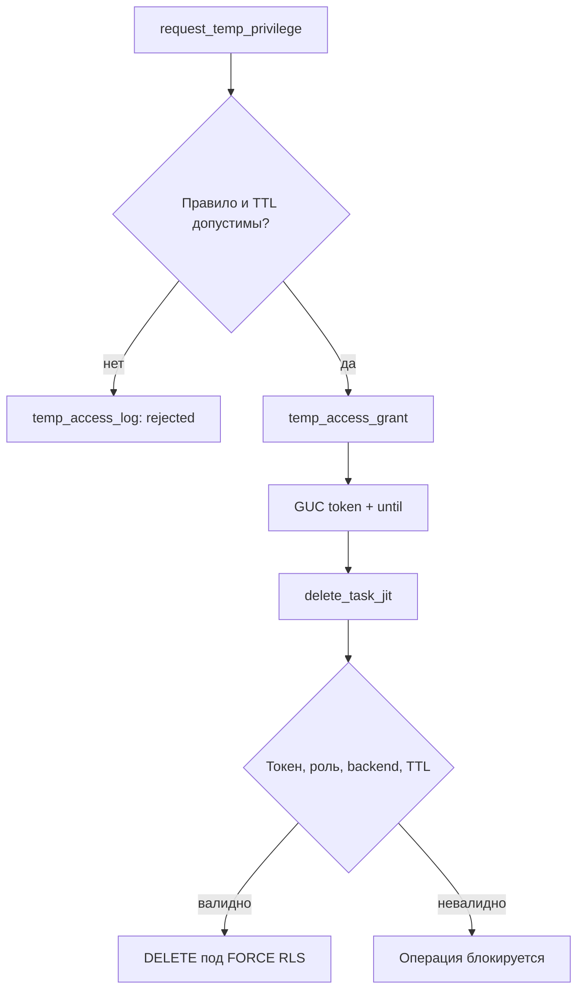

# Лабораторная работа № 4 и практическая часть РГЗ

## Безопасные представления, аудит, производительность и JIT-доступ

[← Лабораторная работа № 3](03-lab-3-rls.md) · [К содержанию](../README.md)

## 1. План работы

В этом разделе создаются:

1. обновляемое представление с `WITH CHECK OPTION`;
2. агрегатное представление с `security_barrier`;
3. аудит `UPDATE`/`DELETE` для трёх критичных таблиц;
4. атомарное архивирование старых записей;
5. воспроизводимый стенд сравнения запросов без RLS и с RLS;
6. система временного допуска Just-In-Time для удаления задачи.

## 2. Обновляемое безопасное представление

### 2.1. Определение

Представление показывает только рабочие задачи с приоритетом 1–3 и не раскрывает `planned_hours`/`actual_hours` роли общего чтения.

```sql
SET ROLE app_owner;

CREATE VIEW app.v_open_task
WITH (
    security_invoker = true
)
AS
SELECT
    task_id,
    segment_id,
    project_id,
    assignee_actor_id,
    title,
    status_code,
    priority,
    due_date,
    updated_at
FROM app.task
WHERE status_code IN ('new', 'in_progress', 'blocked')
  AND priority BETWEEN 1 AND 3
WITH CASCADED CHECK OPTION;

GRANT SELECT ON app.v_open_task TO app_reader;
GRANT UPDATE (assignee_actor_id, title, priority, due_date)
ON app.v_open_task TO app_writer;

RESET ROLE;
```

Свойство `security_invoker = true` заставляет PostgreSQL проверять права и RLS базовой таблицы для вызывающей роли. Без этого по умолчанию применяются права владельца представления, что требует отдельного анализа безопасности.

`WITH CHECK OPTION` запрещает `INSERT`/`UPDATE`, после которого строка перестала бы удовлетворять условию представления. В данном примере изменение приоритета на 4 или 5 через представление отклоняется.

### 2.2. Проверка

```sql
SET SESSION AUTHORIZATION lab_alice;

SELECT task_id, segment_id, title, status_code, priority
FROM app.v_open_task
ORDER BY task_id;

BEGIN;
UPDATE app.v_open_task
SET priority = 5
WHERE task_id = 1001;
ROLLBACK;

RESET SESSION AUTHORIZATION;
```

Ожидание:

- `SELECT` возвращает только строки сегмента 1 благодаря RLS;
- `UPDATE` отклоняется как нарушение `WITH CHECK OPTION`, поскольку `priority = 5` исключает строку из представления.

## 3. Агрегатное security-barrier-представление

### 3.1. Определение

```sql
SET ROLE app_owner;

CREATE VIEW app.v_task_summary
WITH (
    security_barrier = true,
    security_invoker = true
)
AS
SELECT
    segment_id,
    status_code,
    count(*) AS task_count,
    sum(planned_hours) AS planned_hours_sum,
    sum(COALESCE(actual_hours, 0)) AS actual_hours_sum
FROM app.task
GROUP BY segment_id, status_code;

GRANT SELECT ON app.v_task_summary TO app_writer, auditor;

RESET ROLE;
```

`security_barrier` ограничивает перестановку небезопасных пользовательских предикатов относительно условий представления. Это снижает риск передачи скрытых значений функциям с побочными эффектами. Свойство не является универсальной защитой от всех побочных каналов и может ухудшать план запроса.

`security_invoker` обеспечивает применение RLS для фактического пользователя:

- Alice получает агрегаты сегмента 1;
- Bob — сегмента 2;
- auditor — всех сегментов согласно отдельной RLS-политике.

### 3.2. Проверка

```sql
SET SESSION AUTHORIZATION lab_alice;

SELECT *
FROM app.v_task_summary
ORDER BY segment_id, status_code;

RESET SESSION AUTHORIZATION;
```

Попытка запросить несуществующую детальную колонку закономерно завершается ошибкой:

```sql
SELECT title FROM app.v_task_summary;
```

Внешний `HAVING` может фильтровать только доступные агрегаты:

```sql
SELECT segment_id, status_code, task_count
FROM app.v_task_summary
WHERE task_count > 1;
```

Важно: если пользователь имеет прямой доступ к базовой таблице, представление не отменяет этот доступ. Представление считается единственным интерфейсом только после отзыва избыточных прямых прав либо при использовании специально спроектированной definer-модели.

## 4. Журнал изменений

### 4.1. Таблица текущего журнала и архив

```sql
SET ROLE audit_owner;

CREATE TABLE audit.row_change_log (
    change_id       bigint GENERATED ALWAYS AS IDENTITY,
    changed_at      timestamptz NOT NULL DEFAULT clock_timestamp(),
    actor_role      name        NOT NULL,
    effective_role  name        NOT NULL,
    schema_name     name        NOT NULL,
    table_name      name        NOT NULL,
    operation       text        NOT NULL,
    segment_id      smallint,
    row_pk          jsonb       NOT NULL,
    old_data        jsonb,
    new_data        jsonb,
    txid            xid8        DEFAULT pg_current_xact_id_if_assigned(),

    CONSTRAINT pk_row_change_log PRIMARY KEY (change_id),
    CONSTRAINT ck_row_change_log_operation
        CHECK (operation IN ('UPDATE', 'DELETE'))
);

CREATE INDEX ix_row_change_log_time
    ON audit.row_change_log (changed_at DESC);

CREATE INDEX ix_row_change_log_table_time
    ON audit.row_change_log (schema_name, table_name, changed_at DESC);

CREATE INDEX ix_row_change_log_actor_time
    ON audit.row_change_log (actor_role, changed_at DESC);

CREATE TABLE audit.row_change_log_archive (
    change_id       bigint      NOT NULL,
    changed_at      timestamptz NOT NULL,
    actor_role      name        NOT NULL,
    effective_role  name        NOT NULL,
    schema_name     name        NOT NULL,
    table_name      name        NOT NULL,
    operation       text        NOT NULL,
    segment_id      smallint,
    row_pk          jsonb       NOT NULL,
    old_data        jsonb,
    new_data        jsonb,
    txid            xid8,
    archived_at     timestamptz NOT NULL DEFAULT clock_timestamp(),

    CONSTRAINT pk_row_change_log_archive PRIMARY KEY (change_id),
    CONSTRAINT ck_row_change_log_archive_operation
        CHECK (operation IN ('UPDATE', 'DELETE'))
);

CREATE INDEX ix_row_change_log_archive_time
    ON audit.row_change_log_archive (changed_at DESC);

GRANT SELECT ON audit.row_change_log, audit.row_change_log_archive
TO auditor;

RESET ROLE;
```

### 4.2. Маскирование PII

Вспомогательная функция удаляет открытые email/телефон из JSON-образа сотрудника. Email заменяется SHA-256-отпечатком, телефон — маской. SHA-256 без секретного ключа является псевдонимизацией, а не полной анонимизацией: словарный перебор известных адресов возможен. В продуктивной системе применяют HMAC с ключом вне БД либо полностью исключают исходный атрибут из аудита.

```sql
SET ROLE audit_owner;

CREATE OR REPLACE FUNCTION audit.mask_audit_row(
    p_table_name text,
    p_row jsonb
)
RETURNS jsonb
LANGUAGE plpgsql
IMMUTABLE
SECURITY DEFINER
SET search_path = pg_catalog, audit, pg_temp
AS $$
DECLARE
    v_result jsonb;
    v_email text;
BEGIN
    IF p_row IS NULL THEN
        RETURN NULL;
    END IF;

    v_result := p_row;

    IF p_table_name = 'actor' THEN
        v_email := p_row ->> 'email';
        v_result := v_result - 'email' - 'phone';

        IF v_email IS NOT NULL THEN
            v_result := v_result || jsonb_build_object(
                'email_sha256',
                encode(sha256(convert_to(lower(v_email), 'UTF8')), 'hex')
            );
        END IF;

        v_result := v_result || jsonb_build_object(
            'phone', '[REDACTED]'
        );
    END IF;

    RETURN v_result;
END;
$$;

REVOKE ALL ON FUNCTION audit.mask_audit_row(text, jsonb) FROM PUBLIC;

RESET ROLE;
```

### 4.3. Универсальная триггерная функция

```sql
SET ROLE audit_owner;

CREATE OR REPLACE FUNCTION audit.capture_row_change()
RETURNS trigger
LANGUAGE plpgsql
SECURITY DEFINER
SET search_path = pg_catalog, audit, pg_temp
AS $$
DECLARE
    v_old jsonb;
    v_new jsonb;
    v_source jsonb;
    v_pk jsonb;
    v_segment_id smallint;
BEGIN
    IF TG_OP = 'UPDATE' THEN
        v_old := to_jsonb(OLD);
        v_new := to_jsonb(NEW);
        v_source := v_new;
    ELSIF TG_OP = 'DELETE' THEN
        v_old := to_jsonb(OLD);
        v_new := NULL;
        v_source := v_old;
    ELSE
        RAISE EXCEPTION 'Unsupported operation: %', TG_OP;
    END IF;

    v_segment_id := NULLIF(v_source ->> 'segment_id', '')::smallint;

    v_pk := CASE TG_TABLE_NAME
        WHEN 'actor' THEN
            jsonb_build_object('actor_id', v_source -> 'actor_id')
        WHEN 'project' THEN
            jsonb_build_object('project_id', v_source -> 'project_id')
        WHEN 'task' THEN
            jsonb_build_object('task_id', v_source -> 'task_id')
        ELSE
            jsonb_build_object('unknown', NULL)
    END;

    INSERT INTO audit.row_change_log (
        changed_at,
        actor_role,
        effective_role,
        schema_name,
        table_name,
        operation,
        segment_id,
        row_pk,
        old_data,
        new_data,
        txid
    )
    VALUES (
        clock_timestamp(),
        session_user,
        current_user,
        TG_TABLE_SCHEMA,
        TG_TABLE_NAME,
        TG_OP,
        v_segment_id,
        v_pk,
        audit.mask_audit_row(TG_TABLE_NAME, v_old),
        audit.mask_audit_row(TG_TABLE_NAME, v_new),
        pg_current_xact_id_if_assigned()
    );

    IF TG_OP = 'DELETE' THEN
        RETURN OLD;
    END IF;

    RETURN NEW;
END;
$$;

REVOKE ALL ON FUNCTION audit.capture_row_change() FROM PUBLIC;
GRANT EXECUTE ON FUNCTION audit.capture_row_change() TO app_owner;

RESET ROLE;
```

### 4.4. Триггеры на критичных таблицах

```sql
SET ROLE app_owner;

CREATE TRIGGER trg_audit_actor_change
AFTER UPDATE OR DELETE ON app.actor
FOR EACH ROW
EXECUTE FUNCTION audit.capture_row_change();

CREATE TRIGGER trg_audit_project_change
AFTER UPDATE OR DELETE ON app.project
FOR EACH ROW
EXECUTE FUNCTION audit.capture_row_change();

CREATE TRIGGER trg_audit_task_change
AFTER UPDATE OR DELETE ON app.task
FOR EACH ROW
EXECUTE FUNCTION audit.capture_row_change();

RESET ROLE;
```

Триггер выполняется в той же транзакции, что и изменение. Если прикладная операция откатывается, запись `row_change_log` тоже откатывается. Это обеспечивает согласованность, но не защищает от владельца БД или superuser, способного отключить триггер. Для независимого неизменяемого аудита нужен внешний контур.

## 5. Тесты представлений и аудита

### Тест 1. WITH CHECK OPTION

```sql
SET SESSION AUTHORIZATION lab_alice;

BEGIN;
UPDATE app.v_open_task
SET priority = 5
WHERE task_id = 1001;
ROLLBACK;

RESET SESSION AUTHORIZATION;
```

Ожидание: строка не может покинуть множество, определённое представлением.

### Тест 2. Агрегаты и RLS

```sql
SET SESSION AUTHORIZATION lab_bob;

SELECT *
FROM app.v_task_summary
ORDER BY segment_id, status_code;

RESET SESSION AUTHORIZATION;
```

Ожидание: только агрегаты сегмента 2.

### Тест 3. UPDATE создаёт запись аудита

```sql
SET SESSION AUTHORIZATION lab_alice;

UPDATE app.task
SET title = 'Спроектировать защищённый API'
WHERE task_id = 1001;

RESET SESSION AUTHORIZATION;

SET SESSION AUTHORIZATION lab_auditor;

SELECT changed_at, actor_role, effective_role,
       table_name, operation, row_pk, old_data, new_data
FROM audit.row_change_log
WHERE table_name = 'task'
ORDER BY change_id DESC
LIMIT 1;

RESET SESSION AUTHORIZATION;
```

Ожидание: `actor_role = lab_alice`, `operation = UPDATE`; в `old_data` и `new_data` видны разные названия.

### Тест 4. PII не сохраняется открыто

```sql
SET SESSION AUTHORIZATION lab_alice;

UPDATE app.actor
SET email = 'anna.updated@example.test'
WHERE actor_id = 1;

RESET SESSION AUTHORIZATION;

SET SESSION AUTHORIZATION lab_auditor;

SELECT old_data, new_data
FROM audit.row_change_log
WHERE table_name = 'actor'
ORDER BY change_id DESC
LIMIT 1;

RESET SESSION AUTHORIZATION;
```

Ожидание: открытых полей `email` и исходного телефона нет; присутствуют `email_sha256` и маска телефона.

### Тест 5. Чужое изменение не создаёт аудит

```sql
SET SESSION AUTHORIZATION lab_alice;

UPDATE app.task
SET title = 'Попытка чужого изменения'
WHERE task_id = 2001;

RESET SESSION AUTHORIZATION;
```

Ожидание: `UPDATE 0`; триггер не вызывается, новая запись журнала не появляется.

### Тест 6. Прямой INSERT в журнал запрещён

```sql
SET SESSION AUTHORIZATION lab_alice;

INSERT INTO audit.row_change_log (
    actor_role, effective_role, schema_name, table_name,
    operation, row_pk
)
VALUES (
    'lab_alice', 'lab_alice', 'app', 'task',
    'UPDATE', '{"task_id": 1}'::jsonb
);

RESET SESSION AUTHORIZATION;
```

Ожидание: ошибка доступа к схеме или таблице `audit`.

## 6. Архивирование журнала изменений

### 6.1. Функция атомарного переноса

```sql
GRANT USAGE ON SCHEMA audit TO dml_admin;

SET ROLE audit_owner;

CREATE OR REPLACE FUNCTION audit.backup_audit_logs(
    p_days_interval integer
)
RETURNS integer
LANGUAGE plpgsql
SECURITY DEFINER
SET search_path = pg_catalog, audit, pg_temp
AS $$
DECLARE
    v_moved integer;
BEGIN
    IF p_days_interval IS NULL
       OR p_days_interval < 1
       OR p_days_interval > 3650 THEN
        RAISE EXCEPTION USING
            ERRCODE = '22023',
            MESSAGE = 'days_interval должен быть в диапазоне 1..3650';
    END IF;

    WITH moved AS (
        DELETE FROM audit.row_change_log
        WHERE changed_at < clock_timestamp()
                         - make_interval(days => p_days_interval)
        RETURNING
            change_id,
            changed_at,
            actor_role,
            effective_role,
            schema_name,
            table_name,
            operation,
            segment_id,
            row_pk,
            old_data,
            new_data,
            txid
    )
    INSERT INTO audit.row_change_log_archive (
        change_id,
        changed_at,
        actor_role,
        effective_role,
        schema_name,
        table_name,
        operation,
        segment_id,
        row_pk,
        old_data,
        new_data,
        txid,
        archived_at
    )
    SELECT
        change_id,
        changed_at,
        actor_role,
        effective_role,
        schema_name,
        table_name,
        operation,
        segment_id,
        row_pk,
        old_data,
        new_data,
        txid,
        clock_timestamp()
    FROM moved;

    GET DIAGNOSTICS v_moved = ROW_COUNT;
    RETURN v_moved;
END;
$$;

REVOKE ALL ON FUNCTION audit.backup_audit_logs(integer) FROM PUBLIC;
GRANT EXECUTE ON FUNCTION audit.backup_audit_logs(integer) TO dml_admin;

RESET ROLE;
```

`DELETE ... RETURNING` и `INSERT` находятся в одном SQL-операторе и одной транзакции. Если вставка в архив не выполняется, удаление из основной таблицы тоже откатывается.

### 6.2. Проверка на синтетической старой записи

```sql
SET ROLE audit_owner;

INSERT INTO audit.row_change_log (
    changed_at,
    actor_role,
    effective_role,
    schema_name,
    table_name,
    operation,
    segment_id,
    row_pk,
    old_data,
    new_data
)
VALUES (
    clock_timestamp() - interval '40 days',
    'lab_alice',
    'audit_owner',
    'app',
    'task',
    'UPDATE',
    1,
    '{"task_id": "archive-demo"}'::jsonb,
    '{"title": "old"}'::jsonb,
    '{"title": "new"}'::jsonb
);

RESET ROLE;

SET ROLE dml_admin;
SELECT audit.backup_audit_logs(30) AS moved_rows;
RESET ROLE;
```

Проверка:

```sql
SELECT count(*)
FROM audit.row_change_log
WHERE row_pk = '{"task_id": "archive-demo"}'::jsonb;

SELECT change_id, changed_at, archived_at, row_pk
FROM audit.row_change_log_archive
WHERE row_pk = '{"task_id": "archive-demo"}'::jsonb;
```

Функция названа `backup_audit_logs` в соответствии с заданием, но технически это **архивирование внутри той же базы**, а не резервное копирование. Отказ диска, повреждение кластера или действия superuser могут затронуть обе таблицы. Настоящая стратегия восстановления включает `pg_dump`/`pg_restore` либо физическое резервное копирование и WAL-архив.

## 7. Анализ производительности RLS

### 7.1. Почему основной набор недостаточен

На 15 строках планировщик закономерно выбирает последовательное сканирование. Разница в долях миллисекунды определяется шумом измерений. Для демонстрации создаются две одинаковые таблицы по 300 000 строк:

- `stg.task_perf_no_rls` — контрольная таблица без RLS;
- `stg.task_perf_rls` — таблица с политикой сегментации.

### 7.2. Подготовка данных

```sql
SET ROLE app_owner;

CREATE TABLE stg.task_perf_no_rls (
    task_id     bigint   NOT NULL,
    segment_id smallint NOT NULL,
    status_code text     NOT NULL,
    due_date     date,
    payload      text     NOT NULL,
    CONSTRAINT pk_task_perf_no_rls PRIMARY KEY (task_id),
    CONSTRAINT ck_task_perf_no_rls_segment
        CHECK (segment_id BETWEEN 1 AND 3),
    CONSTRAINT ck_task_perf_no_rls_status
        CHECK (status_code IN ('new', 'in_progress', 'blocked', 'done'))
);

CREATE TABLE stg.task_perf_rls
(LIKE stg.task_perf_no_rls INCLUDING ALL);

INSERT INTO stg.task_perf_no_rls (
    task_id, segment_id, status_code, due_date, payload
)
SELECT
    g,
    (((g - 1) % 3) + 1)::smallint,
    CASE g % 4
        WHEN 0 THEN 'new'
        WHEN 1 THEN 'in_progress'
        WHEN 2 THEN 'blocked'
        ELSE 'done'
    END,
    DATE '2026-01-01' + (g % 365)::integer,
    repeat('x', 100)
FROM generate_series(1, 300000) AS g;

INSERT INTO stg.task_perf_rls
SELECT * FROM stg.task_perf_no_rls;

ALTER TABLE stg.task_perf_rls ENABLE ROW LEVEL SECURITY;
ALTER TABLE stg.task_perf_rls FORCE ROW LEVEL SECURITY;

CREATE POLICY task_perf_segment
ON stg.task_perf_rls
FOR SELECT
TO app_reader, app_owner
USING (segment_id = app.effective_segment_id());

GRANT USAGE ON SCHEMA stg TO app_reader;
GRANT SELECT ON stg.task_perf_no_rls, stg.task_perf_rls TO app_reader;

RESET ROLE;

ANALYZE stg.task_perf_no_rls;
ANALYZE stg.task_perf_rls;
```

### 7.3. Замеры до составного индекса

Контрольный запрос явно содержит сегмент:

```sql
SET SESSION AUTHORIZATION lab_alice;

EXPLAIN (ANALYZE, BUFFERS, TIMING OFF, SUMMARY ON)
SELECT count(*)
FROM stg.task_perf_no_rls
WHERE segment_id = 1
  AND status_code = 'in_progress'
  AND due_date BETWEEN DATE '2026-04-01' AND DATE '2026-06-30';

RESET SESSION AUTHORIZATION;
```

В RLS-варианте прикладной запрос не содержит `segment_id`; условие добавляет политика:

```sql
SET SESSION AUTHORIZATION lab_alice;

EXPLAIN (ANALYZE, BUFFERS, TIMING OFF, SUMMARY ON)
SELECT count(*)
FROM stg.task_perf_rls
WHERE status_code = 'in_progress'
  AND due_date BETWEEN DATE '2026-04-01' AND DATE '2026-06-30';

RESET SESSION AUTHORIZATION;
```

Дополнительные типовые запросы:

```sql
-- Ближайшие 50 задач.
SELECT task_id, status_code, due_date
FROM stg.task_perf_rls
WHERE status_code IN ('new', 'in_progress')
ORDER BY due_date, task_id
LIMIT 50;

-- Распределение по состояниям.
SELECT status_code, count(*)
FROM stg.task_perf_rls
GROUP BY status_code
ORDER BY status_code;
```

Каждый запрос также запускается через `EXPLAIN (ANALYZE, BUFFERS, TIMING OFF)`.

### 7.4. Индексы под условие политики и запрос

```sql
SET ROLE app_owner;

CREATE INDEX ix_task_perf_no_rls_segment_status_due
    ON stg.task_perf_no_rls (segment_id, status_code, due_date);

CREATE INDEX ix_task_perf_rls_segment_status_due
    ON stg.task_perf_rls (segment_id, status_code, due_date);

RESET ROLE;

VACUUM (ANALYZE) stg.task_perf_no_rls;
VACUUM (ANALYZE) stg.task_perf_rls;
```

Повторите три запроса после создания индекса. Для запроса с сортировкой может быть полезен другой индекс:

```sql
CREATE INDEX ix_task_perf_rls_segment_due_id
    ON stg.task_perf_rls (segment_id, due_date, task_id)
    INCLUDE (status_code);
```

Не добавляйте оба индекса в окончательный проект без анализа реальной нагрузки. Частично перекрывающиеся индексы ускоряют чтение, но увеличивают запись и объём хранения.

### 7.5. Методика сравнения

Для каждого запроса зафиксируйте:

- типы узлов плана: `Seq Scan`, `Index Scan`, `Index Only Scan`, `Bitmap Heap Scan`;
- `actual rows`;
- `Rows Removed by Filter`;
- `Planning Time` и `Execution Time`;
- `Buffers: shared hit/read`;
- условие `Index Cond` и остаточный `Filter`.

Выполните один прогревочный и не менее пяти измеряемых запусков. Рассчитайте медиану.

Шаблон таблицы:

| Запрос | Режим | Индекс | Медиана, ms | shared hit | shared read | План |
|---|---|---|---:|---:|---:|---|
| Q1 count | без RLS | нет |  |  |  |  |
| Q1 count | RLS | нет |  |  |  |  |
| Q1 count | без RLS | да |  |  |  |  |
| Q1 count | RLS | да |  |  |  |  |

Нельзя приписывать всю разницу только RLS, если запросы, кэш, статистика или индексы различаются. В отчёте укажите аппаратную платформу, ОС, версию PostgreSQL, объём данных и состояние кэша.

## 8. JIT-доступ: модель безопасности

### 8.1. Почему одного GUC недостаточно

Пользователь может выполнить:

```sql
SET app.temp_privilege_until = '2999-01-01 00:00:00+00';
```

Поэтому GUC используется только как сеансовый маркер. Действительность допуска проверяется по защищённой таблице, где запись связана с:

- криптографически случайным UUID;
- `session_user`;
- именем операции;
- PID backend-процесса;
- временем запуска backend;
- серверным `expires_at`;
- признаком отзыва.



### 8.2. Белый список операций

```sql
SET ROLE app_owner;

CREATE TABLE ref.temp_operation_rule (
    allowed_role     name     NOT NULL,
    operation_name   text     NOT NULL,
    max_duration_min integer  NOT NULL,
    is_active        boolean  NOT NULL DEFAULT true,

    CONSTRAINT pk_temp_operation_rule
        PRIMARY KEY (allowed_role, operation_name),
    CONSTRAINT ck_temp_operation_rule_name
        CHECK (operation_name ~ '^[a-z][a-z0-9_.]{2,63}$'),
    CONSTRAINT ck_temp_operation_rule_duration
        CHECK (max_duration_min BETWEEN 1 AND 120)
);

INSERT INTO ref.temp_operation_rule (
    allowed_role, operation_name, max_duration_min
)
VALUES ('app_writer', 'task.delete', 15);

RESET ROLE;

GRANT USAGE ON SCHEMA ref TO audit_owner;
GRANT SELECT ON ref.temp_operation_rule TO audit_owner;
```

Роль `app_writer` по-прежнему не получает прямой `DELETE`:

```sql
REVOKE DELETE ON app.task FROM app_writer;
```

### 8.3. Журнал запросов и таблица активных допусков

```sql
SET ROLE audit_owner;

CREATE TABLE audit.temp_access_log (
    request_id              bigint GENERATED ALWAYS AS IDENTITY,
    request_time            timestamptz NOT NULL DEFAULT clock_timestamp(),
    caller_role             name        NOT NULL,
    operation               text        NOT NULL,
    requested_duration_min  integer,
    expires_at              timestamptz,
    approved                boolean     NOT NULL,
    denial_reason           text,
    backend_pid             integer     NOT NULL,

    CONSTRAINT pk_temp_access_log PRIMARY KEY (request_id),
    CONSTRAINT ck_temp_access_log_result
        CHECK ((approved AND expires_at IS NOT NULL AND denial_reason IS NULL)
            OR (NOT approved AND denial_reason IS NOT NULL))
);

CREATE INDEX ix_temp_access_log_role_time
    ON audit.temp_access_log (caller_role, request_time DESC);

CREATE TABLE audit.temp_access_grant (
    grant_id       uuid        NOT NULL,
    request_id     bigint      NOT NULL,
    caller_role    name        NOT NULL,
    operation      text        NOT NULL,
    backend_pid    integer     NOT NULL,
    backend_start  timestamptz NOT NULL,
    granted_at     timestamptz NOT NULL DEFAULT clock_timestamp(),
    expires_at     timestamptz NOT NULL,
    revoked_at     timestamptz,

    CONSTRAINT pk_temp_access_grant PRIMARY KEY (grant_id),
    CONSTRAINT fk_temp_access_grant_request
        FOREIGN KEY (request_id)
        REFERENCES audit.temp_access_log(request_id),
    CONSTRAINT ck_temp_access_grant_period
        CHECK (expires_at > granted_at),
    CONSTRAINT ck_temp_access_grant_revoke
        CHECK (revoked_at IS NULL OR revoked_at >= granted_at)
);

CREATE INDEX ix_temp_access_grant_lookup
    ON audit.temp_access_grant (
        caller_role, operation, backend_pid, backend_start, expires_at
    )
    WHERE revoked_at IS NULL;

GRANT SELECT ON audit.temp_access_log, audit.temp_access_grant TO auditor;

RESET ROLE;
```

## 9. Функция request_temp_privilege

```sql
GRANT USAGE ON SCHEMA audit TO app_writer;

SET ROLE audit_owner;

CREATE OR REPLACE FUNCTION audit.request_temp_privilege(
    p_operation_name text,
    p_duration_min integer
)
RETURNS TABLE (
    ok boolean,
    message text,
    grant_id uuid,
    expires_at timestamptz
)
LANGUAGE plpgsql
SECURITY DEFINER
SET search_path = pg_catalog, audit, ref, pg_temp
AS $$
DECLARE
    v_operation text;
    v_allowed_role name;
    v_max_duration integer;
    v_expires_at timestamptz;
    v_grant_id uuid;
    v_request_id bigint;
    v_backend_start timestamptz;
    v_reason text;
BEGIN
    v_operation := lower(btrim(COALESCE(p_operation_name, '')));

    IF v_operation = '' THEN
        v_reason := 'Имя операции не задано';
    ELSIF p_duration_min IS NULL OR p_duration_min < 1 THEN
        v_reason := 'Длительность должна быть не менее одной минуты';
    END IF;

    IF v_reason IS NULL THEN
        SELECT r.allowed_role, r.max_duration_min
        INTO v_allowed_role, v_max_duration
        FROM ref.temp_operation_rule AS r
        WHERE r.operation_name = v_operation
          AND r.is_active
          AND pg_has_role(session_user, r.allowed_role, 'member')
        ORDER BY r.max_duration_min
        LIMIT 1;

        IF v_allowed_role IS NULL THEN
            v_reason := 'Операция не разрешена вызывающей роли';
        ELSIF p_duration_min > v_max_duration THEN
            v_reason := format(
                'Запрошенная длительность превышает максимум %s мин.',
                v_max_duration
            );
        END IF;
    END IF;

    IF v_reason IS NOT NULL THEN
        INSERT INTO audit.temp_access_log (
            caller_role,
            operation,
            requested_duration_min,
            expires_at,
            approved,
            denial_reason,
            backend_pid
        )
        VALUES (
            session_user,
            COALESCE(NULLIF(v_operation, ''), '<empty>'),
            p_duration_min,
            NULL,
            false,
            v_reason,
            pg_backend_pid()
        );

        RETURN QUERY SELECT false, v_reason, NULL::uuid, NULL::timestamptz;
        RETURN;
    END IF;

    SELECT a.backend_start
    INTO v_backend_start
    FROM pg_catalog.pg_stat_activity AS a
    WHERE a.pid = pg_backend_pid();

    IF v_backend_start IS NULL THEN
        v_reason := 'Не удалось определить идентификатор backend-сеанса';

        INSERT INTO audit.temp_access_log (
            caller_role, operation, requested_duration_min,
            approved, denial_reason, backend_pid
        )
        VALUES (
            session_user, v_operation, p_duration_min,
            false, v_reason, pg_backend_pid()
        );

        RETURN QUERY SELECT false, v_reason, NULL::uuid, NULL::timestamptz;
        RETURN;
    END IF;

    v_grant_id := gen_random_uuid();
    v_expires_at := clock_timestamp()
                    + make_interval(mins => p_duration_min);

    INSERT INTO audit.temp_access_log (
        caller_role,
        operation,
        requested_duration_min,
        expires_at,
        approved,
        denial_reason,
        backend_pid
    )
    VALUES (
        session_user,
        v_operation,
        p_duration_min,
        v_expires_at,
        true,
        NULL,
        pg_backend_pid()
    )
    RETURNING request_id INTO v_request_id;

    INSERT INTO audit.temp_access_grant (
        grant_id,
        request_id,
        caller_role,
        operation,
        backend_pid,
        backend_start,
        granted_at,
        expires_at
    )
    VALUES (
        v_grant_id,
        v_request_id,
        session_user,
        v_operation,
        pg_backend_pid(),
        v_backend_start,
        clock_timestamp(),
        v_expires_at
    );

    -- Маркеры сохраняются до конца физического сеанса или RESET.
    -- Проверяющая функция не доверяет им без серверной записи.
    PERFORM set_config('app.temp_privilege_token', v_grant_id::text, false);
    PERFORM set_config('app.temp_privilege_until', v_expires_at::text, false);

    RETURN QUERY
        SELECT true, 'Временный допуск выдан'::text,
               v_grant_id, v_expires_at;
END;
$$;

REVOKE ALL ON FUNCTION audit.request_temp_privilege(text, integer)
FROM PUBLIC;
GRANT EXECUTE ON FUNCTION audit.request_temp_privilege(text, integer)
TO app_writer;

RESET ROLE;
```

Функция не выполняет `GRANT DELETE`. Полномочия роли в системном каталоге не меняются; выдаётся только ограниченный серверный допуск на одну именованную операцию.

## 10. Проверка активного допуска

```sql
SET ROLE audit_owner;

CREATE OR REPLACE FUNCTION audit.has_temp_privilege(
    p_operation_name text
)
RETURNS boolean
LANGUAGE plpgsql
VOLATILE
SECURITY DEFINER
SET search_path = pg_catalog, audit, pg_temp
AS $$
DECLARE
    v_token_text text;
    v_token uuid;
    v_backend_start timestamptz;
    v_result boolean;
BEGIN
    v_token_text := current_setting('app.temp_privilege_token', true);

    IF v_token_text IS NULL OR v_token_text = '' THEN
        RETURN false;
    END IF;

    BEGIN
        v_token := v_token_text::uuid;
    EXCEPTION
        WHEN invalid_text_representation THEN
            RETURN false;
    END;

    SELECT a.backend_start
    INTO v_backend_start
    FROM pg_catalog.pg_stat_activity AS a
    WHERE a.pid = pg_backend_pid();

    SELECT EXISTS (
        SELECT 1
        FROM audit.temp_access_grant AS g
        WHERE g.grant_id = v_token
          AND g.caller_role = session_user
          AND g.operation = lower(btrim(p_operation_name))
          AND g.backend_pid = pg_backend_pid()
          AND g.backend_start = v_backend_start
          AND g.revoked_at IS NULL
          AND g.granted_at <= clock_timestamp()
          AND g.expires_at > clock_timestamp()
    )
    INTO v_result;

    RETURN COALESCE(v_result, false);
END;
$$;

REVOKE ALL ON FUNCTION audit.has_temp_privilege(text) FROM PUBLIC;
GRANT EXECUTE ON FUNCTION audit.has_temp_privilege(text) TO app_owner;

RESET ROLE;
```

Пользователь может изменить GUC, но не может создать строку в `audit.temp_access_grant`, подобрать UUID, изменить привязку к backend или продлить серверный `expires_at`.

## 11. Чувствительная операция удаления задачи

```sql
SET ROLE app_owner;

CREATE OR REPLACE FUNCTION app.delete_task_jit(
    p_task_id bigint
)
RETURNS TABLE (
    ok boolean,
    message text,
    object_id bigint
)
LANGUAGE plpgsql
SECURITY DEFINER
SET search_path = pg_catalog, app, audit, pg_temp
AS $$
DECLARE
    v_deleted_id bigint;
    v_error text;
    v_params jsonb;
BEGIN
    v_params := jsonb_build_object('task_id', p_task_id);

    IF p_task_id IS NULL THEN
        v_error := 'task_id обязателен';
        PERFORM audit.write_function_call(
            'app.delete_task_jit', v_params, false, v_error
        );
        RETURN QUERY SELECT false, v_error, NULL::bigint;
        RETURN;
    END IF;

    IF NOT audit.has_temp_privilege('task.delete') THEN
        v_error := 'Активный временный допуск task.delete отсутствует';
        PERFORM audit.write_function_call(
            'app.delete_task_jit', v_params, false, v_error
        );
        RETURN QUERY SELECT false, v_error, NULL::bigint;
        RETURN;
    END IF;

    DELETE FROM app.task
    WHERE task_id = p_task_id
    RETURNING task_id INTO v_deleted_id;

    IF v_deleted_id IS NULL THEN
        v_error := 'Задача не найдена или недоступна';
        PERFORM audit.write_function_call(
            'app.delete_task_jit', v_params, false, v_error
        );
        RETURN QUERY SELECT false, v_error, NULL::bigint;
        RETURN;
    END IF;

    PERFORM audit.write_function_call(
        'app.delete_task_jit', v_params, true, NULL
    );

    RETURN QUERY SELECT true, 'Задача удалена'::text, v_deleted_id;
EXCEPTION
    WHEN OTHERS THEN
        GET STACKED DIAGNOSTICS v_error = MESSAGE_TEXT;
        PERFORM audit.write_function_call(
            'app.delete_task_jit',
            COALESCE(v_params, '{}'::jsonb),
            false,
            left(v_error, 1000)
        );
        RETURN QUERY
            SELECT false, ('Операция отклонена: ' || v_error)::text, NULL::bigint;
END;
$$;

REVOKE ALL ON FUNCTION app.delete_task_jit(bigint) FROM PUBLIC;
GRANT EXECUTE ON FUNCTION app.delete_task_jit(bigint) TO app_writer;

RESET ROLE;
```

Удаление выполняется как `app_owner`, но `FORCE RLS` сохраняет сегментное ограничение. Политика `task_delete_segment` применима к `app_owner` и вычисляет сегмент по `session_user`.

## 12. Полный JIT-тест

Тест необходимо выполнить в одном физическом соединении. Два тестовых объекта позволяют проверить успешное удаление и отказ после TTL.

### 12.1. Создание тестовых задач

```sql
SET SESSION AUTHORIZATION lab_alice;

INSERT INTO app.task (
    segment_id, project_id, assignee_actor_id, title,
    status_code, priority, planned_hours
)
VALUES (1, 101, 1, 'JIT demo: удалить до TTL', 'new', 3, 1)
RETURNING task_id \gset jit_first_

INSERT INTO app.task (
    segment_id, project_id, assignee_actor_id, title,
    status_code, priority, planned_hours
)
VALUES (1, 101, 1, 'JIT demo: проверить после TTL', 'new', 3, 1)
RETURNING task_id \gset jit_second_

SELECT :jit_first_task_id AS first_task,
       :jit_second_task_id AS second_task;
```

### 12.2. Прямое удаление запрещено

Выполните отдельно, поскольку ожидается ошибка:

```sql
DELETE FROM app.task WHERE task_id = :jit_first_task_id;
```

Ожидание: недостаточно привилегии `DELETE`.

### 12.3. Запрос временного допуска

```sql
SELECT *
FROM audit.request_temp_privilege('task.delete', 1)
\gset jit_grant_

SELECT :'jit_grant_ok' AS approved,
       :'jit_grant_grant_id' AS grant_id,
       :'jit_grant_expires_at' AS expires_at,
       current_setting('app.temp_privilege_until', true) AS guc_until;
```

Ожидание: `approved = t`, TTL равен одной минуте.

### 12.4. Выполнение до истечения

```sql
SELECT * FROM app.delete_task_jit(:jit_first_task_id);
```

Ожидание: `ok = true`. В `audit.row_change_log` появляется `DELETE`, а в `audit.function_calls` — успешный вызов.

### 12.5. Ожидание истечения и повторная попытка

```sql
SELECT pg_sleep(61);

SELECT * FROM app.delete_task_jit(:jit_second_task_id);
```

Ожидание: `ok = false`; вторая задача остаётся в таблице. Никакой фоновый процесс для блокировки не нужен: срок проверяется при каждой чувствительной операции.

Завершение теста:

```sql
RESET SESSION AUTHORIZATION;

-- Очистка оставшейся демонстрационной строки выполняется superuser,
-- который в учебной среде обходит RLS.
DELETE FROM app.task
WHERE task_id = :jit_second_task_id;
```

### 12.6. Ускоренная демонстрация без ожидания

Если на защите нельзя ждать минуту, администратор может искусственно завершить выданный допуск:

```sql
UPDATE audit.temp_access_grant
SET expires_at = clock_timestamp() - interval '1 second'
WHERE grant_id = :'jit_grant_grant_id'::uuid;
```

Это делает только администратор в демонстрационных целях. Прикладная роль не имеет такого права.

### 12.7. Проверка журналов

```sql
SET SESSION AUTHORIZATION lab_auditor;

SELECT request_time, caller_role, operation,
       requested_duration_min, expires_at, approved, denial_reason
FROM audit.temp_access_log
ORDER BY request_id DESC
LIMIT 10;

SELECT caller_role, operation, backend_pid,
       granted_at, expires_at, revoked_at
FROM audit.temp_access_grant
ORDER BY granted_at DESC
LIMIT 10;

SELECT call_time, function_name, caller_role, success, error_message
FROM audit.function_calls
WHERE function_name = 'app.delete_task_jit'
ORDER BY call_id DESC
LIMIT 10;

RESET SESSION AUTHORIZATION;
```

## 13. Дополнительные негативные JIT-тесты

### Неизвестная операция

```sql
SET SESSION AUTHORIZATION lab_alice;
SELECT * FROM audit.request_temp_privilege('project.drop', 5);
RESET SESSION AUTHORIZATION;
```

Ожидание: `ok = false`, запрос записан как отклонённый.

### Превышение максимального TTL

```sql
SET SESSION AUTHORIZATION lab_alice;
SELECT * FROM audit.request_temp_privilege('task.delete', 60);
RESET SESSION AUTHORIZATION;
```

Ожидание: отклонение, поскольку максимум правила — 15 минут.

### Подмена срока GUC

```sql
SET SESSION AUTHORIZATION lab_alice;

SET app.temp_privilege_until = '2999-01-01 00:00:00+00';
SET app.temp_privilege_token = '00000000-0000-0000-0000-000000000000';

SELECT * FROM app.delete_task_jit(1003);

RESET SESSION AUTHORIZATION;
```

Ожидание: `ok = false`, потому что серверной записи с таким UUID и привязкой нет.

### Токен из другой сессии

Скопируйте реальный UUID в другой терминал под той же ролью и установите его через `SET`. Проверка должна вернуть `false`, поскольку PID и `backend_start` отличаются.

### Чужой сегмент при действующем TTL

```sql
SET SESSION AUTHORIZATION lab_alice;
SELECT * FROM audit.request_temp_privilege('task.delete', 1);
SELECT * FROM app.delete_task_jit(2001);
RESET SESSION AUTHORIZATION;
```

Ожидание: временный допуск действителен, но RLS скрывает задачу сегмента 2; функция возвращает «не найдена или недоступна».

## 14. Диагностика и усиление JIT-механизма

### Возможные улучшения

- добавить двухэтапное согласование заявки отдельной ролью `approver`;
- ограничить количество одновременных активных допусков;
- добавить `reason` и номер заявки, но фильтровать PII;
- реализовать немедленный отзыв через `revoked_at`;
- очищать истёкшие гранты отдельной регламентной функцией;
- добавить advisory lock, если возможны конкурентные запросы;
- отправлять события во внешний неизменяемый журнал;
- привязать допуск к конкретному объекту, например `task_id`, а не ко всем задачам своего сегмента;
- применять HMAC/подписанный токен, если серверную таблицу использовать нельзя.

### Что механизм не решает

- superuser остаётся за пределами прикладной модели;
- компрометация ОС или каталога данных не блокируется;
- открытая пользовательская сессия с активным TTL может быть использована злоумышленником;
- GUC видим внутри сеанса и не является секретом;
- внутренний аудит не равен внешнему неизменяемому журналу.

## 15. Структура отчёта РГЗ примерно на 50 страниц

Рекомендуемое распределение материала:

| Раздел | Ориентировочный объём |
|---|---:|
| Титульный лист, содержание, обозначения | 2–3 стр. |
| Предметная область и модель угроз | 3–4 стр. |
| ER-модель и классификация | 4–5 стр. |
| DDL и обеспечение целостности | 5–6 стр. |
| Роли, RBAC и разделение обязанностей | 4–5 стр. |
| SECURITY DEFINER и тесты | 5–6 стр. |
| RLS и контекст сеанса | 6–7 стр. |
| Представления и аудит | 5–6 стр. |
| Производительность | 4–5 стр. |
| Архивирование и восстановление | 2–3 стр. |
| JIT-доступ | 5–6 стр. |
| Выводы и ограничения | 2–3 стр. |
| Приложения с полным SQL | без жёсткого ограничения |

Скриншоты не должны заменять объяснение. Для каждого теста укажите:

1. проверяемое свойство;
2. исходную роль и контекст;
3. SQL-команду;
4. ожидаемый результат;
5. фактический результат;
6. вывод.

## 16. Итоговая матрица средств защиты

| Риск | Основной механизм | Дополнительный механизм | Проверка |
|---|---|---|---|
| Доступ к чужому филиалу | RLS | составные FK | кросс-сегментные тесты |
| Избыточный DML | RBAC | SECURITY DEFINER | прямой DML отклонён |
| Подмена объекта в функции | фиксированный `search_path` | квалифицированные имена | временный одноимённый объект |
| Утечка через VIEW | `security_invoker` + RLS | `security_barrier` | разные сегменты |
| Выход строки из VIEW | `WITH CHECK OPTION` | табличные CHECK | изменение приоритета |
| Незаметное изменение | AFTER trigger | внешний серверный лог | запись old/new |
| PII в аудите | маскирование/хэш | минимизация полей | поиск открытых значений |
| Рост аудита | архивирование | настоящий backup/PITR | перенос старых строк |
| Постоянный DELETE | JIT TTL | прямой DELETE отозван | до/после expiry |
| Подмена JIT GUC | защищённая grant-таблица | token + backend binding | ложный UUID |

## 17. Финальная проверка воспроизводимости

На чистой базе выполните полный набор сценариев и сохраните протокол:

```console
psql -X -v ON_ERROR_STOP=1 -U postgres -d security_lab -f sql/init.sql > init.log 2>&1
```

Проверьте:

```sql
-- Объекты.
\dn+
\dt app.*
\dt ref.*
\dt audit.*
\dv+ app.*
\df+ app.*
\df+ audit.*

-- RLS.
SELECT * FROM pg_policies ORDER BY schemaname, tablename, policyname;

-- Права.
\dp app.*
\dp audit.*
\ddp

-- Триггеры.
SELECT event_object_schema, event_object_table,
       trigger_name, action_timing, event_manipulation
FROM information_schema.triggers
WHERE event_object_schema = 'app'
ORDER BY event_object_table, trigger_name;
```

Полный `init.sql` должен останавливаться при первой неожиданной ошибке. Негативные проверки, где ошибка является ожидаемым результатом, лучше вынести из `init.sql` в отдельный тестовый сценарий.

## 18. Контрольные вопросы

1. Чем `security_barrier` отличается от `security_invoker`?
2. Почему `WITH CHECK OPTION` не заменяет RLS?
3. Почему аудит-триггер является частью той же транзакции?
4. Почему SHA-256 email без секретного ключа не является полной анонимизацией?
5. Чем архивная таблица отличается от резервной копии?
6. Почему сравнение RLS на 15 строках методологически слабое?
7. Что означают `shared hit` и `shared read` в `EXPLAIN`?
8. Почему индекс начинается с `segment_id`?
9. Почему `EXPLAIN ANALYZE` нельзя бездумно выполнять для `DELETE` в рабочей БД?
10. Почему JIT-функция не выполняет системный `GRANT DELETE`?
11. Какие поля связывают временный допуск с конкретным сеансом?
12. Почему поддельный `app.temp_privilege_until` не даёт полномочие?
13. Как `FORCE RLS` ограничивает `delete_task_jit()`?
14. Почему после TTL не требуется отдельный планировщик для блокировки?
15. Как немедленно отозвать действующий допуск?

## 19. Материалы для изучения

- [PostgreSQL: CREATE VIEW](https://www.postgresql.org/docs/18/sql-createview.html)
- [PostgreSQL: Rules and Privileges — security barrier](https://www.postgresql.org/docs/18/rules-privileges.html)
- [PostgreSQL: CREATE TRIGGER](https://www.postgresql.org/docs/18/sql-createtrigger.html)
- [PostgreSQL: Trigger Functions](https://www.postgresql.org/docs/18/plpgsql-trigger.html)
- [PostgreSQL: JSON Functions and Operators](https://www.postgresql.org/docs/18/functions-json.html)
- [PostgreSQL: SHA-2 Binary String Functions](https://www.postgresql.org/docs/18/functions-binarystring.html)
- [PostgreSQL: Data-Modifying Statements in WITH](https://www.postgresql.org/docs/18/queries-with.html#QUERIES-WITH-MODIFYING)
- [PostgreSQL: DELETE RETURNING](https://www.postgresql.org/docs/18/dml-returning.html)
- [PostgreSQL: Using EXPLAIN](https://www.postgresql.org/docs/18/using-explain.html)
- [PostgreSQL: EXPLAIN](https://www.postgresql.org/docs/18/sql-explain.html)
- [PostgreSQL: Multicolumn Indexes](https://www.postgresql.org/docs/18/indexes-multicolumn.html)
- [PostgreSQL: Examining Index Usage](https://www.postgresql.org/docs/18/indexes-examine.html)
- [PostgreSQL: pg_dump](https://www.postgresql.org/docs/18/app-pgdump.html)
- [PostgreSQL: Continuous Archiving and Point-in-Time Recovery](https://www.postgresql.org/docs/18/continuous-archiving.html)
- [PostgreSQL: pg_stat_activity](https://www.postgresql.org/docs/18/monitoring-stats.html#MONITORING-PG-STAT-ACTIVITY-VIEW)
- [PostgreSQL: UUID Functions](https://www.postgresql.org/docs/18/functions-uuid.html)
- [OWASP: Logging Cheat Sheet](https://cheatsheetseries.owasp.org/cheatsheets/Logging_Cheat_Sheet.html)
- [OWASP: Authorization Cheat Sheet](https://cheatsheetseries.owasp.org/cheatsheets/Authorization_Cheat_Sheet.html)

## 20. Критерий готовности

Работа завершена, если:

- `WITH CHECK OPTION` блокирует выход строки из представления;
- `security_invoker` сохраняет сегментный RLS-контекст;
- аудитор видит агрегаты всех сегментов, а обычная роль — только своего;
- `UPDATE` и `DELETE` создают журнал, в котором PII не хранится открыто;
- старые записи атомарно переходят в архив;
- производительность измерена на репрезентативном наборе до/после индекса;
- прямой `DELETE` роли `app_writer` запрещён;
- JIT-запрос журналируется, имеет ограниченный TTL и привязан к сеансу;
- операция проходит до TTL, блокируется после TTL и не обходит RLS.
