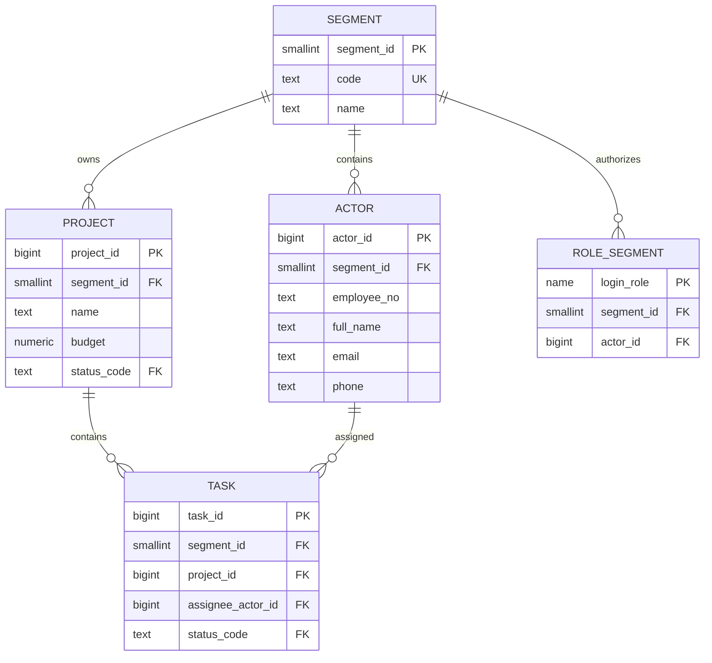
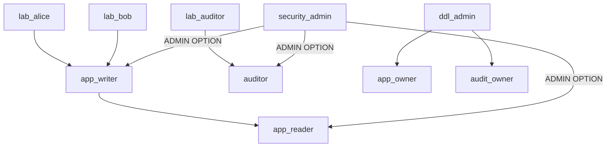

# Лабораторная работа № 1

## Проектирование базы данных, классификация данных и ролевая модель

[← К содержанию](../README.md) · [Лабораторная работа № 2 →](./02-lab-2-security-definer-and-tests.md)

## 1. Результат работы

После выполнения раздела должны существовать:

- схемы `app`, `ref`, `audit`, `stg`;
- таблицы филиалов, сотрудников, проектов и задач;
- не менее 10 записей в каждой ключевой таблице;
- групповые и тестовые login-роли;
- явные привилегии и консервативные `DEFAULT PRIVILEGES`;
- таблица и login event trigger для аудита подключений;
- ER-диаграмма, матрица классификации и тесты полномочий.

Все команды выполняются в учебной базе `security_lab`. Административные блоки запускаются от локальной роли `postgres`, если явно не указано иное.

## 2. Предметная область

Организация состоит из филиалов. Каждый филиал ведёт собственные проекты, назначает сотрудников на задачи и хранит сведения о бюджете и выполнении работ.

Основные сущности:

- `ref.segment` — филиал, то есть сегмент безопасности;
- `app.actor` — сотрудник;
- `app.project` — проект филиала;
- `app.task` — задача проекта;
- `ref.project_status`, `ref.task_status` — справочники состояний;
- `ref.role_segment` — защищённое сопоставление login-роли с филиалом и сотрудником.

### 2.1. ER-диаграмма

GitHub отображает следующий блок как Mermaid-диаграмму:



Готовый PNG для отчёта: [открыть ER-диаграмму](../diagrams/er-diagram.png).

Составной внешний ключ `(segment_id, project_id)` запрещает привязать задачу филиала 1 к проекту филиала 2. Аналогично `(segment_id, assignee_actor_id)` обеспечивает принадлежность исполнителя тому же сегменту. Это ограничение целостности дополняет RLS, но не заменяет его.

## 3. Классификация данных

Используем четыре уровня:

| Класс | Смысл | Примеры | Типовые меры |
|---|---|---|---|
| `Public` | допустимо открытое распространение | публичный код статуса | контроль целостности |
| `Internal` | служебные данные без высокой чувствительности | идентификатор, название задачи | аутентификация, RBAC |
| `Confidential` | коммерчески значимые сведения | бюджет, трудозатраты | ограничение ролей, аудит |
| `Restricted` | PII, секреты и данные с максимальными последствиями раскрытия | email, телефон, токен доступа | минимизация, маскирование, запрет журналирования в открытом виде |

### 3.1. Матрица «колонка → класс»

| Таблица.колонка | Класс | Обоснование | Доступ |
|---|---|---|---|
| `ref.segment.code` | Public | условный код филиала | все прикладные роли |
| `ref.segment.name` | Internal | структура организации | все прикладные роли |
| `app.actor.actor_id` | Internal | технический идентификатор | reader/writer/auditor |
| `app.actor.employee_no` | Confidential | кадровый идентификатор | reader/writer/auditor |
| `app.actor.full_name` | Confidential | идентифицирует физическое лицо | reader/writer/auditor |
| `app.actor.email` | Restricted | контактные PII | dml_admin/auditor/доверенная функция |
| `app.actor.phone` | Restricted | контактные PII | dml_admin/auditor/доверенная функция |
| `app.project.name` | Internal | рабочая информация | reader/writer/auditor |
| `app.project.description` | Internal | рабочая информация | reader/writer/auditor |
| `app.project.budget` | Confidential | финансовые сведения | writer/auditor |
| `app.project.start_date` | Internal | календарный атрибут | reader/writer/auditor |
| `app.project.end_date` | Internal | календарный атрибут | reader/writer/auditor |
| `app.task.title` | Internal | содержание работы | reader/writer/auditor |
| `app.task.planned_hours` | Confidential | плановая оценка | writer/auditor |
| `app.task.actual_hours` | Confidential | фактические трудозатраты | writer/auditor |
| `audit.login_log.client_ip` | Restricted | сетевой идентификатор | auditor |
| `audit.function_calls.input_params` | Restricted | может содержать контекст операции | auditor; обязательная фильтрация |
| `audit.row_change_log.old_data` | Restricted | исторические значения | auditor; PII хэшируются |
| `audit.temp_access_log` | Restricted | сведения о повышении полномочий | auditor |
| пароль login-роли | Restricted | аутентификационный секрет | не хранится в прикладных таблицах и Git |

Матрица должна отражать фактические права. Если `app_reader` получил `SELECT *` на `app.actor`, объявление `email` как `Restricted` не имеет практического значения. Поэтому ниже для `app.actor` применяются колоночные привилегии.

## 4. Создание ролей

### 4.1. Модель ролей



Готовый PNG для отчёта: [открыть диаграмму ролей](../diagrams/roles.png).

Роли `app_owner` и `audit_owner` — технические владельцы без возможности входа. Такое решение уменьшает вероятность ежедневной работы от имени владельца объектов.

### 4.2. SQL создания ролей

Запускайте блок один раз в новом кластере или предварительно удалите только учебные роли.

```sql
\set ON_ERROR_STOP on

CREATE ROLE app_reader
    NOLOGIN NOSUPERUSER NOCREATEDB NOCREATEROLE NOREPLICATION NOBYPASSRLS;

CREATE ROLE app_writer
    NOLOGIN NOSUPERUSER NOCREATEDB NOCREATEROLE NOREPLICATION NOBYPASSRLS;

CREATE ROLE app_owner
    NOLOGIN NOSUPERUSER NOCREATEDB NOCREATEROLE NOREPLICATION NOBYPASSRLS;

CREATE ROLE audit_owner
    NOLOGIN NOSUPERUSER NOCREATEDB NOCREATEROLE NOREPLICATION NOBYPASSRLS;

CREATE ROLE auditor
    NOLOGIN NOSUPERUSER NOCREATEDB NOCREATEROLE NOREPLICATION NOBYPASSRLS;

CREATE ROLE ddl_admin
    NOLOGIN NOSUPERUSER NOCREATEDB NOCREATEROLE NOREPLICATION NOBYPASSRLS;

CREATE ROLE dml_admin
    NOLOGIN NOSUPERUSER NOCREATEDB NOCREATEROLE NOREPLICATION NOBYPASSRLS;

CREATE ROLE security_admin
    NOLOGIN NOSUPERUSER NOCREATEDB NOCREATEROLE NOREPLICATION NOBYPASSRLS;

-- Иерархия прикладных ролей.
GRANT app_reader TO app_writer;

-- DDL-администратор может осознанно переключиться на владельцев объектов,
-- но не наследует их полномочия автоматически.
GRANT app_owner, audit_owner TO ddl_admin
    WITH INHERIT FALSE, SET TRUE;

-- Администратор безопасности может управлять членством,
-- но не получает прикладные данные автоматически.
GRANT app_reader, app_writer, auditor
TO security_admin
    WITH ADMIN TRUE, INHERIT FALSE, SET FALSE;

-- Демонстрационные login-роли без паролей.
-- Для отдельного подключения задайте пароль локально командой \password.
CREATE ROLE lab_alice LOGIN
    NOSUPERUSER NOCREATEDB NOCREATEROLE NOREPLICATION NOBYPASSRLS;
CREATE ROLE lab_bob LOGIN
    NOSUPERUSER NOCREATEDB NOCREATEROLE NOREPLICATION NOBYPASSRLS;
CREATE ROLE lab_auditor LOGIN
    NOSUPERUSER NOCREATEDB NOCREATEROLE NOREPLICATION NOBYPASSRLS;

GRANT app_writer TO lab_alice, lab_bob;
GRANT auditor TO lab_auditor;
```

Проверьте атрибуты:

```sql
SELECT rolname, rolcanlogin, rolsuper, rolcreaterole, rolbypassrls
FROM pg_roles
WHERE rolname IN (
    'app_reader', 'app_writer', 'app_owner', 'audit_owner', 'auditor',
    'ddl_admin', 'dml_admin', 'security_admin',
    'lab_alice', 'lab_bob', 'lab_auditor'
)
ORDER BY rolname;
```

Ни одна прикладная роль не должна иметь `rolsuper = true` или `rolbypassrls = true`.

## 5. Схемы и базовый запрет PUBLIC

```sql
REVOKE ALL ON DATABASE security_lab FROM PUBLIC;
GRANT CONNECT ON DATABASE security_lab
TO app_reader, app_writer, auditor, ddl_admin, dml_admin, security_admin;

REVOKE ALL ON SCHEMA public FROM PUBLIC;

CREATE SCHEMA app   AUTHORIZATION app_owner;
CREATE SCHEMA ref   AUTHORIZATION app_owner;
CREATE SCHEMA stg   AUTHORIZATION app_owner;
CREATE SCHEMA audit AUTHORIZATION audit_owner;

REVOKE ALL ON SCHEMA app, ref, stg, audit FROM PUBLIC;

GRANT USAGE ON SCHEMA app, ref TO app_reader, app_writer;
GRANT USAGE ON SCHEMA app, ref, audit TO auditor;
GRANT USAGE ON SCHEMA app, ref, stg TO dml_admin;
```

`USAGE` на схему разрешает разрешение имён объектов, но само по себе не даёт доступ к таблицам.

## 6. DDL справочников и прикладных таблиц

### 6.1. Справочники

```sql
SET ROLE app_owner;

CREATE TABLE ref.segment (
    segment_id  smallint GENERATED ALWAYS AS IDENTITY,
    code        text     NOT NULL,
    name        text     NOT NULL,
    is_active   boolean  NOT NULL DEFAULT true,
    CONSTRAINT pk_segment PRIMARY KEY (segment_id),
    CONSTRAINT uq_segment_code UNIQUE (code),
    CONSTRAINT ck_segment_code CHECK (code ~ '^[A-Z][A-Z0-9_]{1,15}$'),
    CONSTRAINT ck_segment_name CHECK (btrim(name) <> '')
);

CREATE TABLE ref.project_status (
    status_code text NOT NULL,
    display_name text NOT NULL,
    CONSTRAINT pk_project_status PRIMARY KEY (status_code),
    CONSTRAINT ck_project_status_code
        CHECK (status_code IN ('planned', 'active', 'closed', 'cancelled'))
);

CREATE TABLE ref.task_status (
    status_code text NOT NULL,
    display_name text NOT NULL,
    CONSTRAINT pk_task_status PRIMARY KEY (status_code),
    CONSTRAINT ck_task_status_code
        CHECK (status_code IN ('new', 'in_progress', 'blocked', 'done', 'cancelled'))
);

RESET ROLE;
```

### 6.2. Сотрудники

```sql
SET ROLE app_owner;

CREATE TABLE app.actor (
    actor_id      bigint GENERATED ALWAYS AS IDENTITY,
    segment_id    smallint    NOT NULL,
    employee_no   text        NOT NULL,
    full_name     text        NOT NULL,
    email         text        NOT NULL,
    phone         text,
    is_active     boolean     NOT NULL DEFAULT true,
    created_at    timestamptz NOT NULL DEFAULT clock_timestamp(),

    CONSTRAINT pk_actor PRIMARY KEY (actor_id),
    CONSTRAINT fk_actor_segment
        FOREIGN KEY (segment_id) REFERENCES ref.segment(segment_id),
    CONSTRAINT uq_actor_segment_id UNIQUE (segment_id, actor_id),
    CONSTRAINT uq_actor_employee UNIQUE (segment_id, employee_no),
    CONSTRAINT ck_actor_employee_no CHECK (employee_no ~ '^[A-Z0-9-]{3,20}$'),
    CONSTRAINT ck_actor_full_name CHECK (char_length(btrim(full_name)) >= 3),
    CONSTRAINT ck_actor_email CHECK (position('@' IN email) > 1)
);

CREATE UNIQUE INDEX ux_actor_segment_email_ci
    ON app.actor (segment_id, lower(email));

CREATE INDEX ix_actor_segment_active
    ON app.actor (segment_id, is_active);

RESET ROLE;
```

Проверка email намеренно упрощена: `CHECK` подтверждает только базовую структуру. Полная проверка адреса регулярным выражением часто отвергает допустимые адреса и не подтверждает существование ящика.

### 6.3. Проекты

```sql
SET ROLE app_owner;

CREATE TABLE app.project (
    project_id    bigint GENERATED ALWAYS AS IDENTITY,
    segment_id    smallint      NOT NULL,
    name          text          NOT NULL,
    description   text,
    budget        numeric(14,2) NOT NULL DEFAULT 0,
    status_code   text          NOT NULL DEFAULT 'planned',
    start_date    date          NOT NULL,
    end_date      date,
    created_at    timestamptz   NOT NULL DEFAULT clock_timestamp(),
    updated_at    timestamptz   NOT NULL DEFAULT clock_timestamp(),

    CONSTRAINT pk_project PRIMARY KEY (project_id),
    CONSTRAINT fk_project_segment
        FOREIGN KEY (segment_id) REFERENCES ref.segment(segment_id),
    CONSTRAINT fk_project_status
        FOREIGN KEY (status_code) REFERENCES ref.project_status(status_code),
    CONSTRAINT uq_project_segment_id UNIQUE (segment_id, project_id),
    CONSTRAINT uq_project_segment_name UNIQUE (segment_id, name),
    CONSTRAINT ck_project_name CHECK (char_length(btrim(name)) >= 3),
    CONSTRAINT ck_project_budget CHECK (budget >= 0),
    CONSTRAINT ck_project_dates CHECK (end_date IS NULL OR end_date >= start_date)
);

CREATE INDEX ix_project_segment_status
    ON app.project (segment_id, status_code);

CREATE INDEX ix_project_segment_dates
    ON app.project (segment_id, start_date, end_date);

RESET ROLE;
```

### 6.4. Задачи

```sql
SET ROLE app_owner;

CREATE TABLE app.task (
    task_id            bigint GENERATED ALWAYS AS IDENTITY,
    segment_id         smallint      NOT NULL,
    project_id         bigint        NOT NULL,
    assignee_actor_id  bigint,
    title               text          NOT NULL,
    status_code         text          NOT NULL DEFAULT 'new',
    priority            smallint      NOT NULL DEFAULT 3,
    planned_hours       numeric(8,2)  NOT NULL DEFAULT 0,
    actual_hours        numeric(8,2),
    due_date             date,
    created_at           timestamptz   NOT NULL DEFAULT clock_timestamp(),
    updated_at           timestamptz   NOT NULL DEFAULT clock_timestamp(),

    CONSTRAINT pk_task PRIMARY KEY (task_id),
    CONSTRAINT uq_task_segment_id UNIQUE (segment_id, task_id),
    CONSTRAINT fk_task_project_segment
        FOREIGN KEY (segment_id, project_id)
        REFERENCES app.project(segment_id, project_id),
    CONSTRAINT fk_task_actor_segment
        FOREIGN KEY (segment_id, assignee_actor_id)
        REFERENCES app.actor(segment_id, actor_id),
    CONSTRAINT fk_task_status
        FOREIGN KEY (status_code) REFERENCES ref.task_status(status_code),
    CONSTRAINT ck_task_title CHECK (char_length(btrim(title)) >= 3),
    CONSTRAINT ck_task_priority CHECK (priority BETWEEN 1 AND 5),
    CONSTRAINT ck_task_planned_hours CHECK (planned_hours >= 0),
    CONSTRAINT ck_task_actual_hours CHECK (actual_hours IS NULL OR actual_hours >= 0)
);

CREATE INDEX ix_task_segment_status
    ON app.task (segment_id, status_code);

CREATE INDEX ix_task_segment_project_status
    ON app.task (segment_id, project_id, status_code);

CREATE INDEX ix_task_segment_assignee
    ON app.task (segment_id, assignee_actor_id)
    WHERE assignee_actor_id IS NOT NULL;

RESET ROLE;
```

Не следует создавать индекс для каждой колонки автоматически. Индекс оправдан, если поддерживает внешний ключ, частый фильтр, сортировку или условие политики RLS. Каждый индекс увеличивает стоимость `INSERT`, `UPDATE`, хранения и обслуживания.

### 6.5. Защищённое сопоставление роли и сегмента

```sql
SET ROLE app_owner;

CREATE TABLE ref.role_segment (
    login_role  name        NOT NULL,
    segment_id  smallint    NOT NULL,
    actor_id    bigint      NOT NULL,
    is_active   boolean     NOT NULL DEFAULT true,
    valid_from  timestamptz NOT NULL DEFAULT clock_timestamp(),
    valid_until timestamptz,

    CONSTRAINT pk_role_segment PRIMARY KEY (login_role),
    CONSTRAINT fk_role_segment_segment
        FOREIGN KEY (segment_id) REFERENCES ref.segment(segment_id),
    CONSTRAINT fk_role_segment_actor
        FOREIGN KEY (segment_id, actor_id)
        REFERENCES app.actor(segment_id, actor_id),
    CONSTRAINT ck_role_segment_period
        CHECK (valid_until IS NULL OR valid_until > valid_from)
);

CREATE INDEX ix_role_segment_active
    ON ref.role_segment (login_role, segment_id)
    WHERE is_active;

RESET ROLE;
```

Прямой `SELECT` к `ref.role_segment` прикладным ролям не выдаётся. В ЛР № 3 таблицу будет читать узкая доверенная функция.

## 7. Тестовые данные

### 7.1. Справочники

```sql
SET ROLE app_owner;

INSERT INTO ref.segment (segment_id, code, name)
OVERRIDING SYSTEM VALUE
VALUES
    (1, 'NSK', 'Новосибирский филиал'),
    (2, 'MSK', 'Московский филиал'),
    (3, 'SPB', 'Санкт-Петербургский филиал');

SELECT setval(
    pg_get_serial_sequence('ref.segment', 'segment_id'),
    (SELECT max(segment_id) FROM ref.segment)
);

INSERT INTO ref.project_status (status_code, display_name) VALUES
    ('planned', 'Запланирован'),
    ('active', 'Выполняется'),
    ('closed', 'Завершён'),
    ('cancelled', 'Отменён');

INSERT INTO ref.task_status (status_code, display_name) VALUES
    ('new', 'Новая'),
    ('in_progress', 'В работе'),
    ('blocked', 'Заблокирована'),
    ('done', 'Выполнена'),
    ('cancelled', 'Отменена');

RESET ROLE;
```

### 7.2. Сотрудники — 12 строк

Данные синтетические и не относятся к реальным людям.

```sql
SET ROLE app_owner;

INSERT INTO app.actor (
    actor_id, segment_id, employee_no, full_name, email, phone
)
OVERRIDING SYSTEM VALUE
VALUES
    (1,  1, 'NSK-001', 'Анна Орлова',    'anna.orlova@example.test',   '+7-900-000-0001'),
    (2,  1, 'NSK-002', 'Илья Соколов',   'ilya.sokolov@example.test',  '+7-900-000-0002'),
    (3,  1, 'NSK-003', 'Мария Белова',   'maria.belova@example.test',  '+7-900-000-0003'),
    (4,  1, 'NSK-004', 'Олег Васильев',  'oleg.vasiliev@example.test', '+7-900-000-0004'),
    (5,  2, 'MSK-001', 'Борис Волков',   'boris.volkov@example.test',  '+7-900-000-0005'),
    (6,  2, 'MSK-002', 'Елена Морозова', 'elena.moroz@example.test',   '+7-900-000-0006'),
    (7,  2, 'MSK-003', 'Денис Павлов',   'denis.pavlov@example.test',  '+7-900-000-0007'),
    (8,  2, 'MSK-004', 'Ирина Фролова',  'irina.frolova@example.test', '+7-900-000-0008'),
    (9,  3, 'SPB-001', 'Павел Егоров',   'pavel.egorov@example.test',  '+7-900-000-0009'),
    (10, 3, 'SPB-002', 'Ольга Крылова',  'olga.krylova@example.test',  '+7-900-000-0010'),
    (11, 3, 'SPB-003', 'Роман Жуков',    'roman.zhukov@example.test',  '+7-900-000-0011'),
    (12, 3, 'SPB-004', 'Нина Комарова',  'nina.komarova@example.test', '+7-900-000-0012');

SELECT setval(
    pg_get_serial_sequence('app.actor', 'actor_id'),
    (SELECT max(actor_id) FROM app.actor)
);

RESET ROLE;
```

### 7.3. Проекты — 12 строк

```sql
SET ROLE app_owner;

INSERT INTO app.project (
    project_id, segment_id, name, description, budget,
    status_code, start_date, end_date
)
OVERRIDING SYSTEM VALUE
VALUES
    (101, 1, 'NSK Portal',       'Портал филиала',         1200000, 'active',  '2026-01-10', NULL),
    (102, 1, 'NSK Analytics',    'Витрина аналитики',       850000, 'planned', '2026-04-01', NULL),
    (103, 1, 'NSK Archive',      'Архив документов',        430000, 'active',  '2026-02-15', NULL),
    (104, 1, 'NSK Migration',    'Миграция справочников',    280000, 'closed',  '2025-10-01', '2026-02-01'),
    (201, 2, 'MSK Billing',      'Расчёт начислений',       2100000, 'active',  '2026-01-05', NULL),
    (202, 2, 'MSK CRM',          'Учёт взаимодействий',     1750000, 'planned', '2026-05-10', NULL),
    (203, 2, 'MSK Integration',  'Интеграционная шина',      990000, 'active',  '2026-03-01', NULL),
    (204, 2, 'MSK Legacy Exit',  'Вывод старой системы',     510000, 'closed',  '2025-08-10', '2026-01-20'),
    (301, 3, 'SPB Warehouse',    'Учёт оборудования',       1350000, 'active',  '2026-02-01', NULL),
    (302, 3, 'SPB Helpdesk',     'Сервис заявок',            760000, 'planned', '2026-06-01', NULL),
    (303, 3, 'SPB Reports',      'Регламентная отчётность',   640000, 'active',  '2026-03-12', NULL),
    (304, 3, 'SPB Pilot',        'Завершённый пилот',         300000, 'closed',  '2025-11-01', '2026-02-28');

SELECT setval(
    pg_get_serial_sequence('app.project', 'project_id'),
    (SELECT max(project_id) FROM app.project)
);

RESET ROLE;
```

### 7.4. Задачи — 15 строк

```sql
SET ROLE app_owner;

INSERT INTO app.task (
    task_id, segment_id, project_id, assignee_actor_id, title,
    status_code, priority, planned_hours, actual_hours, due_date
)
OVERRIDING SYSTEM VALUE
VALUES
    (1001, 1, 101, 1,  'Спроектировать API',         'in_progress', 1, 40, 18, '2026-10-05'),
    (1002, 1, 101, 2,  'Настроить CI',               'new',         2, 16, NULL, '2026-10-08'),
    (1003, 1, 102, 3,  'Согласовать метрики',         'blocked',     2, 24,  6, '2026-10-10'),
    (1004, 1, 103, 4,  'Описать формат архива',       'done',        3, 12, 11, '2026-09-20'),
    (1005, 1, 104, 1,  'Проверить миграцию',          'done',        2, 20, 19, '2026-02-01'),
    (2001, 2, 201, 5,  'Проверить формулы',           'in_progress', 1, 32, 12, '2026-10-04'),
    (2002, 2, 201, 6,  'Подготовить тестовые счета',  'new',         2, 20, NULL, '2026-10-09'),
    (2003, 2, 202, 7,  'Описать карточку клиента',    'new',         3, 16, NULL, '2026-10-15'),
    (2004, 2, 203, 8,  'Настроить очередь событий',   'blocked',     1, 36,  8, '2026-10-07'),
    (2005, 2, 204, 5,  'Закрыть старый контур',       'done',        2, 14, 13, '2026-01-20'),
    (3001, 3, 301, 9,  'Импортировать оборудование',  'in_progress', 2, 28, 10, '2026-10-06'),
    (3002, 3, 301, 10, 'Проверить остатки',           'new',         2, 18, NULL, '2026-10-12'),
    (3003, 3, 302, 11, 'Настроить категории заявок',  'new',         3, 12, NULL, '2026-10-14'),
    (3004, 3, 303, 12, 'Сверить отчёт',               'in_progress', 1, 24,  9, '2026-10-03'),
    (3005, 3, 304, 9,  'Оформить результаты пилота',  'done',        3, 10, 10, '2026-02-28');

SELECT setval(
    pg_get_serial_sequence('app.task', 'task_id'),
    (SELECT max(task_id) FROM app.task)
);

INSERT INTO ref.role_segment (login_role, segment_id, actor_id) VALUES
    ('lab_alice', 1, 1),
    ('lab_bob',   2, 5);

RESET ROLE;
```

Контроль количества строк:

```sql
SELECT 'actor' AS object_name, count(*) FROM app.actor
UNION ALL
SELECT 'project', count(*) FROM app.project
UNION ALL
SELECT 'task', count(*) FROM app.task;
```

## 8. Привилегии

### 8.1. Явные права на существующие объекты

```sql
-- Справочники, предназначенные для приложения.
GRANT SELECT ON ref.segment, ref.project_status, ref.task_status
TO app_reader, app_writer, auditor;

-- Чтение рабочих таблиц с исключением конфиденциальных числовых полей.
GRANT SELECT (
    project_id, segment_id, name, description, status_code,
    start_date, end_date, created_at, updated_at
)
ON app.project TO app_reader;

GRANT SELECT (
    task_id, segment_id, project_id, assignee_actor_id, title,
    status_code, priority, due_date, created_at, updated_at
)
ON app.task TO app_reader;

-- На actor читатель видит только одобренные колонки.
GRANT SELECT (actor_id, segment_id, employee_no, full_name, is_active)
ON app.actor TO app_reader;

-- app_writer наследует app_reader и получает ограниченный DML.
GRANT SELECT (budget) ON app.project TO app_writer;
GRANT SELECT (planned_hours, actual_hours) ON app.task TO app_writer;

GRANT INSERT, UPDATE ON app.project, app.task TO app_writer;
GRANT INSERT (segment_id, employee_no, full_name, email, phone, is_active),
      UPDATE (employee_no, full_name, email, phone, is_active)
ON app.actor TO app_writer;

GRANT USAGE, SELECT ON ALL SEQUENCES IN SCHEMA app TO app_writer;

-- DELETE намеренно отсутствует: он будет доступен только через JIT-функцию.
REVOKE DELETE ON app.project, app.task, app.actor FROM app_writer;

-- DML-администратор обслуживает данные, но не владеет DDL автоматически.
GRANT SELECT, INSERT, UPDATE, DELETE ON ALL TABLES IN SCHEMA app TO dml_admin;
GRANT SELECT, INSERT, UPDATE, DELETE ON ALL TABLES IN SCHEMA stg TO dml_admin;
GRANT USAGE, SELECT ON ALL SEQUENCES IN SCHEMA app, stg TO dml_admin;

-- Аудитор читает прикладные данные и журналы, но не изменяет их.
GRANT SELECT ON app.actor, app.project, app.task TO auditor;
```

Права на `ref.role_segment` не выдаются `app_reader`, `app_writer` или `auditor`: это внутренняя таблица авторизации. Аудитор может получить специальное представление без избыточных полей, если такое требование появится.

### 8.2. Консервативные default privileges

`ALTER DEFAULT PRIVILEGES` действует только на объекты, которые в будущем создаст указанная роль. Настройка от имени `postgres` не меняет будущие объекты `app_owner`, если явно не указать `FOR ROLE app_owner`.

```sql
-- Новые функции не должны автоматически исполняться PUBLIC.
ALTER DEFAULT PRIVILEGES FOR ROLE app_owner
    REVOKE EXECUTE ON ROUTINES FROM PUBLIC;

ALTER DEFAULT PRIVILEGES FOR ROLE audit_owner
    REVOKE EXECUTE ON ROUTINES FROM PUBLIC;

-- Аудитор получает чтение будущих прикладных и аудиторских таблиц.
ALTER DEFAULT PRIVILEGES FOR ROLE app_owner IN SCHEMA app
    GRANT SELECT ON TABLES TO auditor;

ALTER DEFAULT PRIVILEGES FOR ROLE audit_owner IN SCHEMA audit
    GRANT SELECT ON TABLES TO auditor;

-- Writer получает доступ к будущим identity-последовательностям,
-- но права на таблицы всё равно назначаются после классификации.
ALTER DEFAULT PRIVILEGES FOR ROLE app_owner IN SCHEMA app
    GRANT USAGE, SELECT ON SEQUENCES TO app_writer;
```

Почему не применяется автоматическое `GRANT SELECT ON TABLES TO app_reader`? Будущая таблица может содержать `Restricted`-колонки. Явная выдача прав после классификации безопаснее широкого значения по умолчанию.

Проверка:

```sql
\dn+
\dp app.*
\dp ref.*
\ddp
```

## 9. Логирование подключений

### 9.1. Таблица журнала

```sql
SET ROLE audit_owner;

CREATE TABLE audit.login_log (
    login_id          bigint GENERATED ALWAYS AS IDENTITY,
    login_time        timestamptz NOT NULL DEFAULT clock_timestamp(),
    username          name        NOT NULL,
    client_ip         inet,
    database_name     name        NOT NULL,
    application_name  text,
    backend_pid       integer     NOT NULL,
    CONSTRAINT pk_login_log PRIMARY KEY (login_id)
);

CREATE INDEX ix_login_log_time
    ON audit.login_log (login_time DESC);

CREATE INDEX ix_login_log_user_time
    ON audit.login_log (username, login_time DESC);

GRANT SELECT ON audit.login_log TO auditor;

RESET ROLE;
```

`client_ip` может быть `NULL`, если клиент подключён через локальный Unix-сокет. Это нормальное поведение, а не ошибка журнала.

### 9.2. Функция login event trigger

Login event trigger поддерживается PostgreSQL 17 и новее. Создание самого event trigger требует `SUPERUSER`; функция выполняется с правами `audit_owner`.

```sql
SET ROLE audit_owner;

CREATE OR REPLACE FUNCTION audit.capture_login()
RETURNS event_trigger
LANGUAGE plpgsql
SECURITY DEFINER
SET search_path = pg_catalog, audit, pg_temp
AS $$
BEGIN
    -- На физической standby-запись запрещена.
    IF pg_is_in_recovery() THEN
        RETURN;
    END IF;

    INSERT INTO audit.login_log (
        login_time,
        username,
        client_ip,
        database_name,
        application_name,
        backend_pid
    )
    VALUES (
        clock_timestamp(),
        session_user,
        inet_client_addr(),
        current_database(),
        current_setting('application_name', true),
        pg_backend_pid()
    );
EXCEPTION
    WHEN OTHERS THEN
        -- Ошибка аудита не должна заблокировать все подключения.
        RAISE LOG 'capture_login failed for role %: %', session_user, SQLERRM;
END;
$$;

REVOKE ALL ON FUNCTION audit.capture_login() FROM PUBLIC;

RESET ROLE;

-- Только суперпользователь может выполнить CREATE EVENT TRIGGER.
CREATE EVENT TRIGGER et_capture_login
    ON login
    EXECUTE FUNCTION audit.capture_login();
```

Перед первым тестом оставьте одно административное соединение открытым. Если допущена ошибка и новые подключения не проходят, из существующей superuser-сессии выполните:

```sql
ALTER EVENT TRIGGER et_capture_login DISABLE;
```

После исправления:

```sql
ALTER EVENT TRIGGER et_capture_login ENABLE ALWAYS;
```

### 9.3. Проверка реальными подключениями

`SET ROLE` не создаёт новое подключение и не активирует событие `login`. Для проверки задайте локальные пароли интерактивно:

```sql
\password lab_alice
\password lab_bob
\password lab_auditor
```

Откройте новые терминалы:

```console
psql -X -U lab_alice -d security_lab -c "select current_user, session_user"
psql -X -U lab_bob -d security_lab -c "select current_user, session_user"
psql -X -U lab_auditor -d security_lab -c "select current_user, session_user"
```

Просмотрите журнал от имени аудитора или администратора:

```sql
SELECT login_time, username, client_ip, database_name,
       application_name, backend_pid
FROM audit.login_log
ORDER BY login_id DESC
LIMIT 20;
```

Для эксплуатационного аудита дополнительно применяются параметры `log_connections`, `log_disconnections` и подходящий `log_line_prefix`. Таблица внутри БД удобна для лабораторной демонстрации, но серверный журнал лучше сохраняет события, когда сама БД недоступна.

## 10. Проверки доступа до включения RLS

Тесты выполняются из superuser-сессии с `SET SESSION AUTHORIZATION`. В отличие от `SET ROLE`, эта команда корректнее имитирует login-пользователя для последующих функций, использующих `session_user`.

### Тест 1. Reader может читать проект

```sql
SET SESSION AUTHORIZATION lab_alice;
SELECT project_id, name, status_code FROM app.project ORDER BY project_id LIMIT 3;
RESET SESSION AUTHORIZATION;
```

Ожидание до ЛР № 3: строки читаются без сегментной фильтрации. Именно поэтому RBAC недостаточно для мультитенантной изоляции.

### Тест 2. Writer не видит Restricted-колонки через `SELECT *`

```sql
SET SESSION AUTHORIZATION lab_alice;
SELECT * FROM app.actor;
RESET SESSION AUTHORIZATION;
```

Ожидание: `permission denied for table actor`, поскольку `SELECT *` включает `email` и `phone`.

Разрешённый запрос:

```sql
SET SESSION AUTHORIZATION lab_alice;
SELECT actor_id, segment_id, employee_no, full_name, is_active
FROM app.actor
ORDER BY actor_id;
RESET SESSION AUTHORIZATION;
```

### Тест 3. Writer не может выполнить DDL

```sql
SET SESSION AUTHORIZATION lab_alice;
CREATE TABLE app.should_fail(id integer);
RESET SESSION AUTHORIZATION;
```

Ожидание: ошибка `permission denied for schema app`.

### Тест 4. Writer не может удалить задачу

```sql
SET SESSION AUTHORIZATION lab_alice;
DELETE FROM app.task WHERE task_id = 1002;
RESET SESSION AUTHORIZATION;
```

Ожидание: ошибка недостатка табличной привилегии `DELETE`.

### Тест 5. Writer не может читать audit

```sql
SET SESSION AUTHORIZATION lab_alice;
SELECT * FROM audit.login_log;
RESET SESSION AUTHORIZATION;
```

Ожидание: ошибка доступа к схеме `audit`.

### Тест 6. Auditor читает журнал

```sql
SET SESSION AUTHORIZATION lab_auditor;
SELECT login_time, username, client_ip
FROM audit.login_log
ORDER BY login_id DESC
LIMIT 5;
RESET SESSION AUTHORIZATION;
```

Ожидание: запрос выполняется.

### Тест 7. Auditor не меняет журнал

```sql
SET SESSION AUTHORIZATION lab_auditor;
DELETE FROM audit.login_log;
RESET SESSION AUTHORIZATION;
```

Ожидание: ошибка недостатка привилегии.

### Тест 8. Составной FK блокирует межсегментную связь

```sql
SET ROLE app_owner;

INSERT INTO app.task (
    segment_id, project_id, assignee_actor_id, title,
    status_code, priority, planned_hours
)
VALUES (1, 201, 1, 'Чужой проект', 'new', 3, 1);

RESET ROLE;
```

Ожидание: нарушение `fk_task_project_segment`, потому что проект 201 относится к сегменту 2.

После ожидаемой ошибки в `psql` с `ON_ERROR_STOP` запустите тест отдельно либо оберните его в транзакцию без `ON_ERROR_STOP`.

## 11. Что включить в отчёт

1. Цель и версия среды:

   ```sql
   SELECT version();
   SHOW server_encoding;
   SHOW TimeZone;
   ```

2. Краткое описание предметной области.
3. ER-диаграмму с кардинальностями.
4. Полную матрицу классификации.
5. DDL таблиц и объяснение каждого ограничения.
6. Список индексов и обоснование, какие запросы они поддерживают.
7. Диаграмму ролей и таблицу полномочий.
8. Вывод `\dp`, `\dn+`, `\ddp`.
9. Не менее восьми проверок с ожидаемым и фактическим результатом.
10. Три записи разных пользователей в `audit.login_log`.
11. Краткий анализ остаточных рисков: администратор ОС, superuser, дампы, резервные копии, секреты в SQL-файлах.

## 12. Контрольные вопросы

1. Чем `USAGE` на схему отличается от `SELECT` на таблицу?
2. Почему роль-владелец сделана `NOLOGIN`?
3. Почему default privileges зависят от роли, создающей объект?
4. Почему нельзя выдать `SELECT *` на таблицу с PII роли общего чтения?
5. Как составной внешний ключ дополняет будущую RLS-политику?
6. Почему `SET ROLE` не тестирует login event trigger?
7. Почему event trigger должен проверять `pg_is_in_recovery()`?
8. Почему не следует использовать `SUPERUSER` для прикладного аудитора?
9. Какой риск создаёт право `CREATE` в схеме, входящей в `search_path`?
10. Почему факт наличия индекса ещё не означает, что планировщик его применит?

## 13. Материалы для изучения

- [PostgreSQL: Data Definition](https://www.postgresql.org/docs/18/ddl.html)
- [PostgreSQL: Constraints](https://www.postgresql.org/docs/18/ddl-constraints.html)
- [PostgreSQL: Schemas](https://www.postgresql.org/docs/18/ddl-schemas.html)
- [PostgreSQL: Privileges](https://www.postgresql.org/docs/18/ddl-priv.html)
- [PostgreSQL: Database Roles](https://www.postgresql.org/docs/18/user-manag.html)
- [PostgreSQL: Role Membership](https://www.postgresql.org/docs/18/role-membership.html)
- [PostgreSQL: ALTER DEFAULT PRIVILEGES](https://www.postgresql.org/docs/18/sql-alterdefaultprivileges.html)
- [PostgreSQL: Indexes](https://www.postgresql.org/docs/18/indexes.html)
- [PostgreSQL: Database Login Event Trigger Example](https://www.postgresql.org/docs/18/event-trigger-database-login-example.html)
- [PostgreSQL: Error Reporting and Logging](https://www.postgresql.org/docs/18/runtime-config-logging.html)
- [NIST SP 800-60 Vol. 1 Rev. 1: Guide for Mapping Types of Information and Information Systems to Security Categories](https://csrc.nist.gov/pubs/sp/800/60/v1/r1/final)

## 14. Критерий готовности

Лабораторная работа завершена, если база разворачивается на чистом экземпляре, ограничения блокируют некорректные связи, права соответствуют матрице, восемь тестов дают ожидаемые результаты, а реальные новые подключения появляются в `audit.login_log`.
